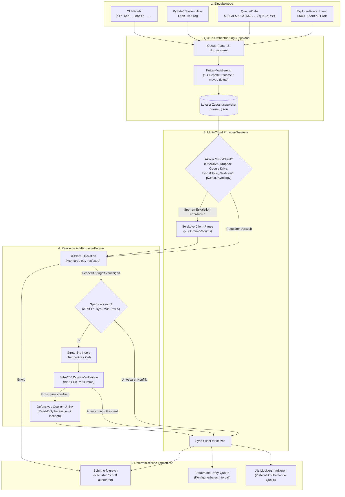
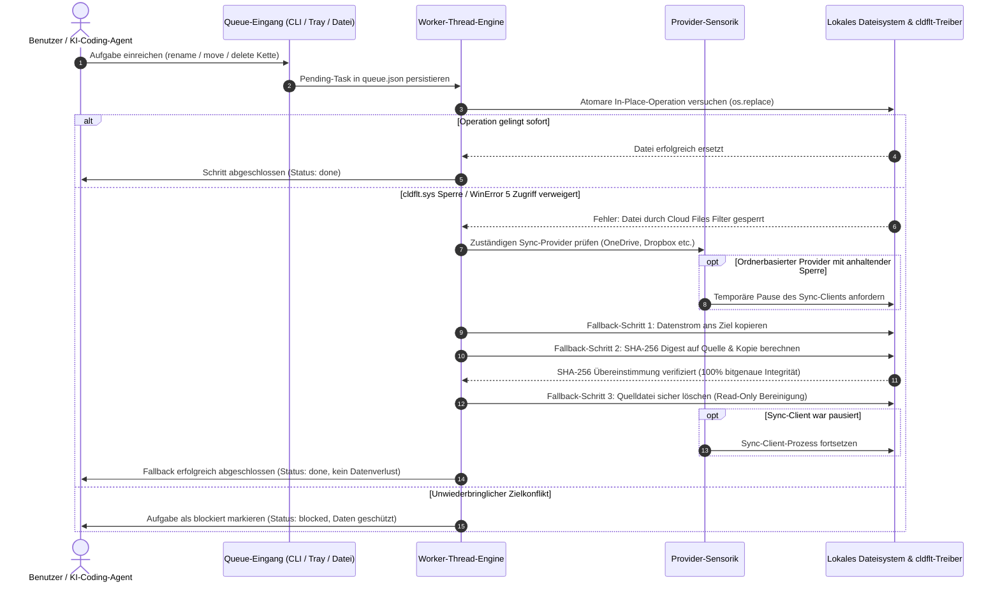

# CloudLockFixer (CLF-WDAS)

[](https://github.com/file-bricks/CloudLockFixer/actions)
[](https://github.com/file-bricks/CloudLockFixer)
[](https://www.python.org/)
[](https://github.com/file-bricks/CloudLockFixer)
[](THIRD_PARTY_LICENSES.md)
[](SECURITY.md)
[](SECURITY.md)
[](LICENSE)
[](THIRD_PARTY_LICENSES.md)
[](https://github.com/file-bricks)
[](https://github.com/open-bricks)
[](pyproject.toml)
[](llms.txt)

> 🌐 **Sprachen:** [English](README.md) | [Deutsch](README.de.md) | [Español](README.es.md)

> [!NOTE]
> **KI- / LLM-Integration:** Dieses Repository enthält eine Datei [`llms.txt`](llms.txt), die maschinenlesbare Architekturrichtlinien, CLI-Schnittstellen und Sicherheitsverträge für KI-Programmierassistenten bereitstellt.

**CloudLockFixer** *with Delayed Action Service* (CLF-WDAS) ist ein autonomes Windows-System-Tray- und CLI-Tool, das Datei- und Ordneroperationen (**umbenennen / verschieben / löschen**) in Cloud-Synchronisationsordnern zuverlässig durchführt — selbst wenn der Windows-Cloud-Files-Filter (`cldflt.sys`) oder aktive Hintergrund-Engines temporäre Sperren halten. Man **trägt eine Aktion ein** und sie wird **„irgendwann" automatisch** mit bitgenauer SHA-256-Prüfung ausgeführt — fire & forget.

---

## Schnellnavigation

1. [Funktionen](#1-funktionen)
2. [Architektur & Systemdesign](#2-architektur--systemdesign)
3. [Zielgruppen & Auffindbarkeit](#3-zielgruppen--auffindbarkeit)
4. [Vergleichsmatrix gegenüber Alternativen](#4-vergleichsmatrix-gegenüber-alternativen)
5. [Duale Mermaid-Diagramme](#5-duale-mermaid-diagramme)
6. [Governance- & Laufzeitinvarianten](#6-governance--laufzeitinvarianten)
7. [Multi-Cloud Provider-Unterstützung](#7-multi-cloud-provider-unterstützung)
8. [Kryptografischer Copy+Delete-Fallback](#8-kryptografischer-copydelete-fallback)
9. [Atomare Mehrschrittketten](#9-atomare-mehrschrittketten)
10. [Visuelle Übersicht & GUI-Workflow](#10-visuelle-übersicht--gui-workflow)
11. [Installation & Schnellstart](#11-installation--schnellstart)
12. [CLI- & Automationsnutzung](#12-cli--automationsnutzung)
13. [Queue-Datei (`queue.txt`) Integration](#13-queue-datei-queuetxt-integration)
14. [Plattform-Parität](#14-plattform-parität)
15. [Tests & Qualitätsverifikation](#15-tests--qualitätsverifikation)
16. [Drittanbieter-Lizenzen & Transparenz](#16-drittanbieter-lizenzen--transparenz)
17. [Geschwister-Ökosystem-Matrix](#17-geschwister-ökosystem-matrix)
18. [Sicherheitsrichtlinie & Rechtliche Hinweise](#18-sicherheitsrichtlinie--rechtliche-hinweise)

---

<a id="1-funktionen"></a><a id="1-features"></a><a id="features"></a><a id="funktionen"></a>
## 1. Funktionen

- **Asynchrone Fire-and-Forget-Aktionen:** Warteschlangen für Umbenennen, Verschieben und Löschen ohne Blockierung interaktiver Arbeitsabläufe.
- **Bitgenauer kryptografischer Copy+Delete-Fallback:** Blockiert der Windows Cloud Files Filter (`cldflt.sys`) atomare Operationen mit `WinError 5` / `EXDEV`, streamt CLF die Daten ans Ziel, verifiziert übereinstimmende SHA-256-Prüfsummen und löscht die Quelle erst danach.
- **Geordnete atomare Mehrschrittketten:** Verkettung von 1–4 Aktionen mit `&&` (z. B. `move A -> B && delete C`). Nachfolgende Schritte starten nur bei Erfolg vorheriger Schritte; destruktive Aktionen werden bei Fehlern übersprungen.
- **Omnichannel-Eingabe:** Aufgaben können via Headless-**CLI** (`clf add`), Klartext-**`queue.txt`**, PySide6-**System-Tray-Dialog** oder Windows Explorer-**Kontextmenü** (`HKCU`) eingereiht werden.
- **Sensorik für 8 Cloud-Provider:** Automatische Erkennung und intelligentes Pausieren/Fortsetzen für OneDrive, Dropbox, Google Drive, Box, iCloud, Nextcloud, pCloud und Synology Drive.
- **Schutz virtueller Laufwerke (Virtual Mount Guard):** Unterscheidet strikt zwischen ordnerbasierten Sync-Engines (OneDrive, Dropbox) und virtuellen Laufwerks-Mounts (Google Drive, pCloud), um Systemabstürze zu verhindern.
- **Deterministische Retry-Engine:** Konfigurierbares Wiederholungsintervall (Standard 2 h) und Wiederholungslimits (`max_retries`). Tasks wechseln deterministisch zwischen `pending`, `retryable`, `blocked`, `failed_permanent` und `done`.
- **100% Local-First & Zero-Egress:** Keine Netzwerkverbindungen, keine Telemetrie, keine externen Sockets. Durch automatisierte statische AST-Vertragstests verifiziert.
- **Unprivilegierte Ausführung (`RunAsInvoker`):** Läuft rein im Benutzerkontext ohne Administratorrechte, UAC-Dialoge oder Kernel-Treiber.

---

<a id="2-architektur--systemdesign"></a><a id="2-architecture"></a><a id="2-architecture--system-design"></a><a id="architecture"></a><a id="interaktive-architektur--lebenszyklus"></a>
## 2. Architektur & Systemdesign

Ausführliche architektonische Spezifikationen und Sicherheitsmodelle siehe [docs/DESIGN.md](docs/DESIGN.md).

Der Windows Cloud Files Minifilter-Treiber (`cldflt.sys`) verwaltet Cloud-Synchronisationsordner (OneDrive, Dropbox, iCloud, Nextcloud etc.). Während eine Datei heruntergeladen, ein Thumbnail generiert oder im Hintergrund synchronisiert wird, fängt `cldflt.sys` normale Win32-Aufrufe wie `rename()` oder `MoveFileEx()` ab und meldet `ERROR_ACCESS_DENIED` (`WinError 5`) oder geräteübergreifende Fehler (`EXDEV`).

```
[Benutzer / Agent Task]
          │
          ▼
 [Queue-Normalisierer] ───► [queue.json Speicher]
                                   │
                                   ▼
                         [Worker-Thread-Engine]
                                   │
                  ┌────────────────┴────────────────┐
                  ▼                                 ▼
         [Direkt In-Place]               [Provider-Sensorik]
       (os.replace / atomar)           (OneDrive, Dropbox etc.)
                  │                                 │
            Sperre aktiv?                           │
                  │ (WinError 5 / cldflt)           ▼
                  ▼                         [Selektive Pause]
       [Copy+Delete-Fallback]             (Nur Ordner-Mounts)
       1. Stream ans Ziel                           │
       2. SHA-256 Digest-Vergleich                  ▼
       3. Defensives Quellen-Unlink      [Sync-Engine fortsetzen]
```

Microsofts empfohlene Lösung für Filtertreiber-Sharing-Violations besteht darin, atomare Rename-Aufrufe durch verifizierte **Copy-and-Delete**-Mechanismen zu ersetzen. CloudLockFixer setzt dieses Muster mit robuster Zustandspersistenz, exponentiellem Backoff und atomaren Mehrschrittketten um.

---

<a id="3-zielgruppen--auffindbarkeit"></a><a id="3-target-personas--discoverability"></a><a id="target-personas"></a>
## 3. Zielgruppen & Auffindbarkeit

CloudLockFixer richtet sich an vier primäre Stakeholder-Personas:

- **`[PERSONA-01]` Desktop-Power-User & Cloud-Sync-Anwender:**
  - *Kontext:* Tägliche Arbeit in lokalen Verzeichnissen, die mit OneDrive, Dropbox, Google Drive oder Nextcloud synchronisiert sind.
  - *Schmerzpunkt:* Wiederkehrende Meldungen wie *„Die Aktion kann nicht abgeschlossen werden, da die Datei in einem anderen Programm geöffnet ist"* während Hintergrund-Synchronisationen.
  - *Vorteil:* Lautlose Hintergrund-Abarbeitung via System-Tray; Umbenennungen oder Bereinigungen einreihen und ohne Unterbrechung weiterarbeiten.
- **`[PERSONA-02]` Autonome KI-Programmier-Agenten & Skript-Entwickler:**
  - *Kontext:* KI-Programmierassistenten (Antigravity, Claude Code, Codex) bei Refactorings und Dateimigrationen.
  - *Schmerzpunkt:* Shell-Skripte brechen abrupt ab, wenn Cloud-Sync-Engines flüchtige Sperren auf Dateien halten.
  - *Vorteil:* Headless-CLI (`clf add --chain ...`), strukturierte `queue.txt` und maschinenlesbare `llms.txt`-Integration mit deterministischen Exit-Codes.
- **`[PERSONA-03]` DevOps-Ingenieure, Systemadministratoren & CI/CD-Entwickler:**
  - *Kontext:* Wartung von Multi-Host-Entwickler-Workstations, automatisierten Test-Runnern und Build-Bereinigungen.
  - *Schmerzpunkt:* Build-Schritte schlagen sporadisch fehl, weil temporäre Testverzeichnisse gesperrt sind.
  - *Vorteil:* Atomare Mehrschrittketten (`op1 && op2 && op3`), konfigurierbare Retry-Limits und plattformübergreifender Kern auf Windows, Linux und macOS.
- **`[PERSONA-04]` Open-Source-Maintainer, Sicherheitsprüfer & Dateisystem-Enthusiasten:**
  - *Kontext:* Organisationen mit strengen Sicherheitsanforderungen an Open-Source-Werkzeuge ohne proprietäre Kernel-Treiber.
  - *Schmerzpunkt:* Viele Datei-Entsperrer benötigen Kernel-Treiber, verlangen Administratorrechte oder bringen Adware mit.
  - *Vorteil:* Vollständig transparente MIT-Lizenzierung, dynamische LGPL-3.0-Isolation, Zero-Egress-Garantie und strikter unprivilegierter `RunAsInvoker`-Modus.

### Relevante Suchanfragen (High-Intent SEO)

| Thematik | Englische Suchanfrage | Deutsche Suchanfrage |
|---|---|---|
| **OneDrive-Sperre** | `onedrive file locked cannot rename move delete fix` | `onedrive datei gesperrt umbenennen fehler beheben` |
| **Treiber-Blockade** | `cldflt.sys file in use error python workaround` | `cldflt fehler 0x8007016A datei verschieben` |
| **Verzögerte Queue** | `windows delayed action file queue open source` | `cloud sync dateisperre automatisches verzögertes verschieben` |
| **Sicherer Fallback** | `copy delete fallback file unlocker python` | `datei wird von einem anderen prozess verwendet cloud sync` |
| **Agenten-Tools** | `automated file rename queue for ai coding agents` | `python dateisystem queue ohne admin rechte` |

---

<a id="4-vergleichsmatrix-gegenüber-alternativen"></a><a id="4-comparative-matrix-vs-alternatives"></a><a id="comparative-matrix"></a>
## 4. Vergleichsmatrix gegenüber Alternativen

| Funktion / Dimension | CloudLockFixer (CLF-WDAS) | Windows Explorer / Shell | LockHunter / Unlocker | Generische Skripte | Cloud-Sync Web-UIs | Invarianten-Bezug |
|---|---|---|---|---|---|---|
| **Zerstörungsfreier Fallback** | :white_check_mark: Bitgenaue SHA-256-Prüfung | :x: Bricht bei Sperre ab (`WinError 5`) | :x: Schließt Handles gewaltsam | :warning: Ungeprüfte Kopie | :x: Nicht zutreffend | `INV-HASH-03` |
| **Filtertreiber-Bewusstsein** | :white_check_mark: Speziell für `cldflt.sys` | :x: Blockiert sofort | :warning: Generischer Handle-Kill | :x: Blindes Wiederholen | :x: Keine | `INV-SENSOR-05` |
| **Atomare Mehrschrittketten** | :white_check_mark: 1–4 Schritte (`&&`) mit Abbruch | :x: Keine | :x: Nur Einzeldurchläufe | :warning: Fehleranfällig | :x: Keine | `INV-CHAIN-04` |
| **Rechteanforderung** | :white_check_mark: Unprivilegiert (`RunAsInvoker`) | :white_check_mark: Benutzermodus | :x: Kernel-Treiber / Admin-UAC | :white_check_mark: Benutzermodus | :white_check_mark: Browser-Sitzung | `INV-RUNAS-02` |
| **Multi-Cloud-Sensorik** | :white_check_mark: 8 Provider automatisch erkannt | :x: Keine | :x: Keine | :x: Keine | :x: Nur eigener Dienst | `INV-SENSOR-05` |
| **Zero-Egress & Datenschutz** | :white_check_mark: 100% Offline (AST-geprüft) | :x: Telemetrie aktiv | :x: Closed Source / Adware-Risiko | :white_check_mark: Lokales Skript | :x: Volle Cloud-Übertragung | `INV-LOCAL-01` |
| **Headless- & KI-Schnittstelle** | :white_check_mark: `clf add` + `queue.txt` + `llms.txt` | :warning: Nur PowerShell | :x: Nur GUI | :warning: Eigene Skripte nötig | :x: Nur Web-Frontend | `INV-DOCS-09` |
| **System-Tray-Integration** | :white_check_mark: PySide6 Tray + Dialoge | :x: Keine | :white_check_mark: GUI-Fenster | :x: Keine | :x: Keine | `INV-PLAT-08` |
| **Deterministisches Retry-Modell** | :white_check_mark: Konfigurierbar mit Zuständen | :x: Manuelles Dialogfeld | :x: Sofortiges Killen | :warning: Starre Sleep-Schleife | :x: Cloud-Eventual | `INV-IDEMP-06` |
| **Sicherheits-SLA & Support** | :white_check_mark: 48h SLA / 5d Triage | :x: Standard-OS-Support | :x: Eingestellt / Ungepflegt | :x: Kein Support | :x: Enterprise-Portal | `INV-SLA-10` |

---

<a id="5-duale-mermaid-diagramme"></a><a id="5-dual-mermaid-diagrams"></a><a id="mermaid-diagrams"></a>
## 5. Duale Mermaid-Diagramme

### Systemarchitektur-Flussdiagramm



### End-to-End Task-Lifecycle Sequenzdiagramm



---

<a id="6-governance--laufzeitinvarianten"></a><a id="6-governance--runtime-invariants"></a><a id="governance-invariants"></a><a id="kernfähigkeiten--governance-garantien"></a>
## 6. Governance- & Laufzeitinvarianten

| Invariante | Kategorie | Verhalten & Implementierung | Governance & Sicherheitsgarantie |
|---|---|---|---|
| `INV-LOCAL-01` | Local-First & Zero Egress | 100% offline-fähige Ausführung ohne externe Netzwerkverbindungen, Tracking oder Telemetrie. | **Hermetische Isolation:** Durch automatisierte AST-Vertragstests verifiziert (`test_offline_zero_egress_no_network_imports`). |
| `INV-RUNAS-02` | Unprivilegierter Modus | Läuft vollständig im unprivilegierten Benutzerbereich (`RunAsInvoker`). | **Eingegrenzter Bereich:** Autostart-Einträge und Kontextmenüs leben rein in `HKCU` ohne UAC-Dialoge oder Root-Rechte. |
| `INV-HASH-03` | Kryptografischer Copy+Delete | Blockiert `cldflt.sys` atomare Verschiebungen, streamt CLF den Inhalt und verifiziert bitgenaue SHA-256 Hashes. | **Kein Datenverlust:** Quelldateien werden erst nach erfolgreichem Prüfsummenabgleich gelöscht. |
| `INV-CHAIN-04` | Atomare Mehrschrittketten | Unterstützt verkettete Operationen von 1–4 Schritten (`rename`, `move`, `delete` getrennt durch `&&`). | **Konditionale Sicherheit:** Schritt $N$ startet nur nach Erfolg von Schritt $N-1$. Destruktive Schritte brechen bei Fehlern ab. |
| `INV-SENSOR-05` | Multi-Cloud-Provider-Sensorik | Erkennt automatisch 8 Cloud-Provider: OneDrive, Dropbox, Google Drive, Box, iCloud, Nextcloud, pCloud, Synology Drive. | **Selektive Pause:** Nur ordnerbasierte Sync-Engines werden bei Dauersperren pausiert; virtuelle Laufwerke werden nie pausiert. |
| `INV-IDEMP-06` | Deterministisches Idempotentes Retry | Aufgaben wechseln zwischen `pending`, `done`, `retryable`, `blocked` und `failed_permanent`. | **Zustandsresilienz:** Fehlende Quellen ohne Ziel werden blockiert; bereits erledigte Schritte bleiben idempotent erfolgreich. |
| `INV-TRIM-07` | Defensives Quellen- & Attribut-Handling | Schreibschutz-Attribute werden vor dem Löschen defensiv entfernt; reine Groß-/Kleinschreibungs-Umbenennungen werden sicher ausgeführt. | **Dateisystem-Sauberkeit:** Schützt vor gesperrten Read-Only-Überresten und inkonsistenten Zwischenzuständen. |
| `INV-PLAT-08` | Plattformübergreifendes Fundament | Plattformübergreifende Abstraktionen und Autostart-Unterstützung für Windows, Linux (XDG Autostart) und macOS (LaunchAgents). | **Plattform-Parität:** Der Kern läuft identisch auf allen modernen Desktop-Betriebssystemen. |
| `INV-DOCS-09` | 1:1 Bilinguale Dokumentation | Symmetrische 18-Punkte-Dokumentationsparität zwischen Englisch (`README.md`) und Deutsch (`README.de.md`) mit `llms.txt`. | **Architektonische Transparenz:** Vollständige Leitfäden für menschliche Entwickler und autonome KI-Coding-Agenten. |
| `INV-SLA-10` | Open-Source-Governance & SLA | MIT-Lizenz, öffentlicher GitHub-Issue-Tracker und verbindliche Sicherheits-SLA. | **Sicherheitsversprechen:** 48-Stunden Reaktions-SLA und 5-Werktage Triage-Zusage gemäß `SECURITY.md`. |

---

<a id="7-multi-cloud-provider-unterstützung"></a><a id="7-multi-cloud-provider-support"></a><a id="cloud-providers"></a><a id="unterstützte-cloud-provider"></a>
## 7. Multi-Cloud Provider-Unterstützung

CloudLockFixer erkennt und steuert die Synchronisationsdienste von 8 führenden Cloud-Anbietern:

| Provider | Bereitstellungstyp | Erkennungsmechanismus | Pause/Resume-Unterstützung | Sicherheitsrichtlinie |
|---|---|---|---|---|
| **OneDrive** | Ordner-Mount | Registry & Umgebungsvariablen (`OneDriveConsumer` / `OneDriveCommercial`) | Ja (`OneDrive.exe`) | Pausiert nur bei anhaltender Sperre in ordnerbasierten Pfaden |
| **Dropbox** | Ordner-Mount | `%LOCALAPPDATA%\Dropbox\info.json` | Ja (`Dropbox.exe`) | Pausiert nur bei anhaltender Sperre in ordnerbasierten Pfaden |
| **Google Drive** | Virtuelles Laufwerk | Laufwerksbuchstaben-Scan & Registry | Nein (Virtual Mount Guard) | Virtuelles Laufwerk — wird niemals pausiert, um Laufwerksabstürze zu vermeiden |
| **Box** | Ordner-Mount | Registry `HKCU\Software\Box\Box` | Ja (`Box.exe`) | Pausiert nur bei anhaltender Sperre in ordnerbasierten Pfaden |
| **iCloud** | Ordner-Mount | Standardpfad `%USERPROFILE%\iCloudDrive` | Ja (`iCloudDrive.exe`) | Pausiert nur bei anhaltender Sperre in ordnerbasierten Pfaden |
| **Nextcloud** | Ordner-Mount | Konfigurationsdatei `%APPDATA%\Nextcloud\nextcloud.cfg` | Ja (`nextcloud.exe`) | Pausiert nur bei anhaltender Sperre in ordnerbasierten Pfaden |
| **pCloud** | Virtuelles Laufwerk | Volume-Label-Prüfung (`pCloud`) | Nein (Virtual Mount Guard) | Virtuelles Laufwerk — wird niemals pausiert, um Laufwerksabstürze zu vermeiden |
| **Synology Drive** | Ordner-Mount | Konfiguration `%LOCALAPPDATA%\SynologyDrive\data\session` | Ja (`SynologyDrive.exe`) | Pausiert nur bei anhaltender Sperre in ordnerbasierten Pfaden |

---

<a id="8-kryptografischer-copydelete-fallback"></a><a id="8-cryptographic-copydelete-fallback"></a><a id="copy-delete-fallback"></a>
## 8. Kryptografischer Copy+Delete-Fallback

In Cloud-synchronisierten Verzeichnissen scheitern `os.replace()` oder `MoveFileEx()` regelmäßig an `ERROR_SHARING_VIOLATION` oder Treibersperren. CloudLockFixer löst dies über einen 3-stufigen Ablauf:

1. **Streaming-Kopie:** Streamt Datei- oder Verzeichnisinhalte über gepufferte Ein-/Ausgabe in ein temporäres Ziel.
2. **Kryptografische SHA-256 Digest-Verifikation:** Berechnet die SHA-256 Prüfsummen von Quelle und Ziel. Bei der kleinsten Abweichung bricht der Vorgang sofort ab und das temporäre Ziel wird verworfen.
3. **Defensives Quellen-Unlink:** Bereinigt Schreibschutz-Attribute und entfernt die Quelldatei. Schlägt das Löschen fehl, bleibt das Ziel erhalten und der Vorgang wandert in die Wiederholungswarteschlange.

---

<a id="9-atomare-mehrschrittketten"></a><a id="9-atomic-multi-step-chains"></a><a id="multi-step-chains"></a>
## 9. Atomare Mehrschrittketten

CloudLockFixer unterstützt das Verketten von bis zu 4 Einzelschritten mit dem `&&`-Operator:

```bash
clf add --chain 'move "C:\local\build.bin" "C:\onedrive\build.bin" && delete "C:\onedrive\old.bin"'
```

- **Strikte Voraussetzungsprüfung:** Schritt $N$ startet ausschließlich dann, wenn Schritt $N-1$ den Status `done` meldet.
- **Fail-Safe-Abbruch:** Tritt bei einem Zwischenschritt ein Fehler oder Zielkonflikt auf, werden alle folgenden Schritte übersprungen, um Datenverlust zu verhindern.
- **Fortschrittssicherung:** Der genaue Schrittstatus wird in `queue.json` persistiert, sodass unterbrochene Ketten nahtlos an der richtigen Stelle fortgesetzt werden.

---

<a id="10-visuelle-übersicht--gui-workflow"></a><a id="10-visual-showcase--gui-workflow"></a><a id="gui-workflow"></a><a id="tray-app"></a>
## 10. Visuelle Übersicht & GUI-Workflow

### PySide6 System-Tray-Oberfläche
CloudLockFixer läuft unaufdringlich im Infobereich der Windows-Taskleiste (System Tray):
- **Aufgabe hinzufügen Dialog:** Intuitive GUI zur Auswahl von Dateien oder Ordnern und Zuordnung verzögerter Aktionen (`Umbenennen`, `Verschieben`, `Löschen`).
- **Jetzt ausführen:** Startet die sofortige Abarbeitung aller wartenden Aufgaben (optional mit temporärer Pause des Sync-Clients).
- **Wiederholungssteuerung:** Ermöglicht das gezielte Wiederholen einzelner fehlgeschlagener Aufgaben oder aller blockierten Tasks (`Retry All`).
- **Konfigurierbares Intervall:** Einstellung des Hintergrundzyklus (in 30-Minuten-Schritten bis zu 12 Stunden; Standard: 2 h).
- **Max. Wiederholungen:** Konfiguration von Wiederholungslimits (Unbegrenzt, 3, 5, 10, 20 Versuche).
- **Desktop-Benachrichtigungen:** Umschalten nativer Windows-Toast-Benachrichtigungen bei dauerhaften Aufgabenfehlern.
- **Autostart mit Windows:** Aktiviert oder deaktiviert den `HKCU`-Registry-Autostart ohne Administratorrechte.
- **Datenordner öffnen:** Direkter Zugriff auf `%LOCALAPPDATA%\CloudLockFixer` mit `queue.txt`, `queue.json` und Logdateien.

---

<a id="11-installation--schnellstart"></a><a id="11-installation--quickstart"></a><a id="installation"></a><a id="einstieg"></a>
## 11. Installation & Schnellstart

### Voraussetzungen
- **Betriebssystem:** Windows 10/11 (für `cldflt.sys`-Treiberbehandlung und Explorer-Integration; Headless-Betrieb auf Linux/macOS unterstützt).
- **Python:** Version 3.10, 3.11, 3.12 oder 3.13.
- **GUI-Engine:** PySide6 (`>=6.7.0`).

### Schnellstart-Schritte
```bash
# 1. Repository klonen
git clone https://github.com/file-bricks/CloudLockFixer.git
cd CloudLockFixer

# 2. Abhängigkeiten installieren
pip install -r requirements.txt

# 3. System-Tray-App starten
START.bat
# Oder direkt via Python:
PYTHONPATH=src python -m cloudlockfixer
```

---

<a id="12-cli--automationsnutzung"></a><a id="12-cli--automation-usage"></a><a id="cli-usage"></a><a id="cli-für-llmskripte"></a>
## 12. CLI- & Automationsnutzung

CloudLockFixer bietet ein leistungsfähiges CLI-Interface für Entwickler, Skripte und KI-Coding-Agenten:

```bash
# Einzelne Aktionen einreihen
clf add --rename "C:\OneDrive\Projekt" "Projekt_Archiv"
clf add --move   "C:\Lokal\Artefakte"  "C:\OneDrive\Artefakte"
clf add --delete "C:\OneDrive\TempCache"

# Atomare Mehrschrittkette einreihen
clf add --chain  'move "C:\Build\bin" "C:\OneDrive\bin" && delete "C:\OneDrive\alte_bin"'

# Warteschlangenstatus einsehen
clf list

# Fehlgeschlagene Tasks wiederholen
clf retry <task-id>
clf retry-all

# Warteschlange sofort verarbeiten
clf run-now
clf run-now --pause
clf run-now --max-retries 5

# Systemdiagnose
clf diagnose
```

*(Entwicklungsaufruf: `PYTHONPATH=src python -m cloudlockfixer.cli ...`)*

---

<a id="13-queue-datei-queuetxt-integration"></a><a id="13-queue-file-queuetxt-integration"></a><a id="queue-file"></a><a id="queuetxt-menschllm"></a>
## 13. Queue-Datei (`queue.txt`) Integration

Für skriptlose oder menschliche Eingaben überwacht CloudLockFixer fortlaufend die Klartext-Warteschlangendatei unter:
`%LOCALAPPDATA%\CloudLockFixer\queue.txt`

Zeilen werden im gewohnten Befehlsformat hinterlegt:
```text
rename "C:\OneDrive\AlterName" "NeuerName"
move "C:\Temp\Daten.zip" "C:\OneDrive\Daten.zip"
delete "C:\OneDrive\VeralteterOrdner"
move "C:\Quelle\A" "C:\Ziel\A" && delete "C:\Ziel\Alt"
```

Nach erfolgreicher Verarbeitung kommentiert der Worker erledigte Zeilen atomar mit `#>` und einem Zeitstempel aus.

---

<a id="14-plattform-parität"></a><a id="14-cross-platform-parity"></a><a id="cross-platform"></a>
## 14. Plattform-Parität

Obwohl die Behebung von `cldflt.sys`-Sperren Windows-spezifisch ist, besitzt CloudLockFixer eine vollständig entkoppelte Plattformarchitektur:
- **Windows:** Native Nutzung von `HKCU`-Registry-Schlüsseln, Win32-Fehlercodes und Explorer-Rechtsklick-Integration.
- **Linux:** Headless-Betrieb mit XDG-Basisverzeichnis-Konformität (`$XDG_DATA_HOME/cloudlockfixer`), `.desktop`-Autostart (`~/.config/autostart`), GNOME/Nautilus-Skripte (`~/.local/share/nautilus/scripts/CloudLockFixer`) und KDE/Dolphin ServiceMenus (`~/.local/share/kio/servicemenus/cloudlockfixer.desktop`).
- **macOS:** Headless-Betrieb mit standardisiertem `~/Library/Application Support/CloudLockFixer`-Datenverzeichnis, LaunchAgent-Plists (`~/Library/LaunchAgents`) und Finder Quick Actions / Services-Workflows (`~/Library/Services/`).

---

<a id="15-tests--qualitätsverifikation"></a><a id="15-testing--quality-verification"></a><a id="testing"></a>
## 15. Tests & Qualitätsverifikation

Das Repository unterliegt strenger automatisierter Qualitätssicherung mit 277 Tests (`pytest`, **277 grün**, 0 Fehler, 100% Erfolgsquote):

```bash
# Gesamte Testsuite ausführen
PYTHONIOENCODING=utf-8 python -m pytest -ra -v

# Code-Stil und Linter prüfen
ruff check .

# Bytecode-Kompilierung validieren
python -m compileall -q src tests

# Plattformübergreifende Smoke-Tests ausführen
python -m pytest tests/source_platform_smoke.py -v
```

Die Testabdeckung umfasst Unit-Tests, Mehrschrittketten, Hash-Verifikation, Provider-Sensormocks, Autostart-Roundtrips, Zero-Egress-AST-Analysen und PEP 621 Metadaten-Vertragstests.

---

<a id="16-drittanbieter-lizenzen--transparenz"></a><a id="16-third-party-licenses--transparency"></a><a id="third-party-licenses"></a><a id="lizenz"></a>
## 16. Drittanbieter-Lizenzen & Transparenz

CloudLockFixer ist Open-Source-Software unter der permissiven [MIT-Lizenz](LICENSE).

Alle Laufzeit- und Entwicklungskomponenten sind transparent in [`THIRD_PARTY_LICENSES.md`](THIRD_PARTY_LICENSES.md) erfasst:
- **PySide6 & shiboken6:** Lizenziert unter **LGPL-3.0-only**. PySide6 wird als unveränderte dynamisch verlinkte Abhängigkeit über offizielle CPython-Wheels bezogen.
- **Zero-Copyleft-Isolation:** Es wird kein proprietärer GPL/AGPL-Code in die Anwendung eingebunden.
- **Unprivilegierte Zertifizierung:** Läuft ausschließlich im unprivilegierten Benutzermodus (`RunAsInvoker`).

---

<a id="17-geschwister-ökosystem-matrix"></a><a id="17-sibling-ecosystem-matrix"></a><a id="sibling-ecosystem"></a><a id="geschwister-ökosystem-matrix"></a>
## 17. Geschwister-Ökosystem-Matrix

CloudLockFixer ist Teil des **file-bricks** und **open-bricks** Desktop- und Entwickler-Ökosystems:

| Repository | Zweck & Spezialisierung | Rolle im Ökosystem | Link |
|---|---|---|---|
| **file-bricks/CloudLockFixer** | Verzögerte Datei-/Ordneroperationen & `cldflt`-Entsperrung | Lokale Dateisystem-Resilienz | [Repository](https://github.com/file-bricks/CloudLockFixer) |
| **file-bricks/SoftwareCenter** | Desktop-Anwendungsportfolio und zentrale Umgebung | Lokales Workstation-Cockpit | [Repository](https://github.com/file-bricks/SoftwareCenter) |
| **file-bricks/knowledgedigest** | Multi-Source Wissensindexierung und Dokumenten-Digest | Desktop-Dokumentenanalyse | [Repository](https://github.com/file-bricks/knowledgedigest) |
| **open-bricks** | Dachorganisation für Open-Source-Software und Standards | Architektonische Governance | [Repository](https://github.com/open-bricks) |
| **ellmos-ai/system-auditor** | Multi-Host Systemauditor und Konfigurationsprüfer | Operative Verifikation | [Repository](https://github.com/ellmos-ai/system-auditor) |
| **ellmos-ai/file-collect-sort-action** | Deklarative Dateiorganisation und Lebenszyklus-Automatisierung | Invarianten-Sortierer | [Repository](https://github.com/ellmos-ai/file-collect-sort-action) |
| **dev-bricks/automizer-for-claude-desktop** | Sicherer Prozess-Staging- und Konfigurationsinjektor | Agentische Desktop-Automation | [Repository](https://github.com/dev-bricks/automizer-for-claude-desktop) |
| **doc-bricks/USR_pic2pic** | Offline Bildformat-Konvertierung und visuelle QS | Lokale Medien-Tools | [Repository](https://github.com/doc-bricks/USR_pic2pic) |
| **doc-bricks/USR_PDFunlock** | Offline PDF-Zugriff und Dokumentensicherheit | Dokumentenverarbeitung | [Repository](https://github.com/doc-bricks/USR_PDFunlock) |

---

<a id="18-sicherheitsrichtlinie--rechtliche-hinweise"></a><a id="18-security-policy--statutory-notice"></a><a id="security-policy"></a><a id="sicherheit--datenschutz"></a>
## 18. Sicherheitsrichtlinie & Rechtliche Hinweise

CloudLockFixer garantiert höchste Standards für Sicherheit und Privatsphäre:
- **100% Local-First & Zero-Egress:** Keine Telemetrie, Analyse-Tracker oder externe Verbindungen.
- **Kryptografische Absicherung:** SHA-256 Prüfsummen stellen sicher, dass Dateien beim Copy+Delete-Fallback niemals verloren gehen.
- **Sicherheits-SLA:** Koordinierte Offenlegung von Sicherheitslücken mit 48-Stunden Reaktionszeit und 5-Werktage Triage-Zusage gemäß [`SECURITY.md`](SECURITY.md).

### Gesetzlicher Haftungsausschluss (§ 521 BGB Gefälligkeitsrecht)

CloudLockFixer wird als unentgeltliche Open-Source-Software im Rahmen eines Gefälligkeitsverhältnisses zur Verfügung gestellt. Gemäß § 521 BGB ist die Haftung des Bereitstellers für Sach- und Rechtsmängel auf Vorsatz und grobe Fahrlässigkeit beschränkt. Die Software wird „wie besehen" („as is") bereitgestellt. Für Verzögerungen bei der Ausführung von Dateisystem-Operationen, Konflikte mit spezifischen Antiviren- oder Filtertreibern oder Datenverluste, die aus unsachgemäßer Konfiguration oder Systemabstürzen resultieren, wird keine Gewährleistung übernommen.
