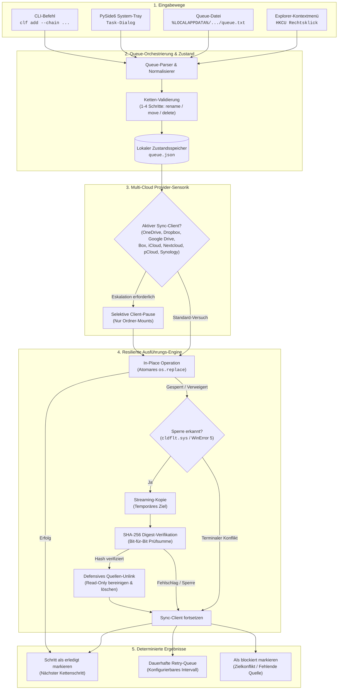
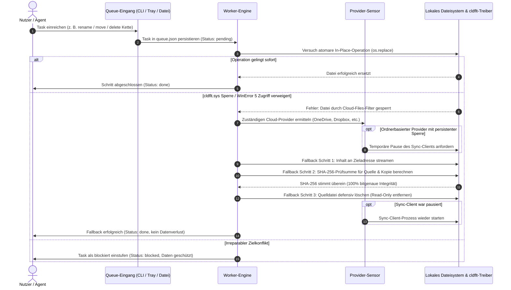

# CloudLockFixer (CLF-WDAS)

[](https://github.com/file-bricks/CloudLockFixer/actions)
[](https://github.com/file-bricks/CloudLockFixer)
[](https://www.python.org/)
[](https://github.com/file-bricks/CloudLockFixer)
[](SECURITY.md)
[](SECURITY.md)
[](LICENSE)
[](https://github.com/file-bricks)
[](https://github.com/open-bricks)
[](pyproject.toml)
[](llms.txt)

> 🇬🇧 **English version:** [README.md](README.md)

> [!NOTE]
> **KI- / LLM-Integration:** Dieses Repository enthält eine Datei [`llms.txt`](llms.txt), die maschinenlesbare Architekturrichtlinien, CLI-Schnittstellen und Sicherheitsverträge für KI-Programmierassistenten bereitstellt.

**CloudLockFixer** *with Delayed Action Service* — ein Windows-Tray- und CLI-Tool, das
Datei-/Ordner-Operationen (**umbenennen / verschieben / löschen**) in Cloud-Sync-
Ordnern zuverlässig erledigt, auch wenn sie der Windows-Cloud-Files-Filter
(`cldflt`) gerade blockiert. Man **trägt eine Aktion ein** und sie wird
**„irgendwann" automatisch** ausgeführt — fire & forget.

---

## Schnellnavigation

- [Überblick](#cloudlockfixer-clf-wdas)
- [Kernfähigkeiten & Governance-Garantien](#kernfähigkeiten--governance-garantien)
- [Interaktive Architektur & Lebenszyklus](#interaktive-architektur--lebenszyklus)
  - [Architektur-Flussdiagramm](#architektur-flussdiagramm)
  - [Task-Lebenszyklus & Fallback-Ablauf](#task-lebenszyklus--fallback-ablauf)
- [Warum CloudLockFixer?](#warum)
- [Einstieg](#einstieg)
- [Funktionen](#funktionen)
- [Unterstützte Cloud-Provider](#unterstützte-cloud-provider)
- [Installation & Schnellstart](#installation)
- [Nutzung](#nutzung)
  - [Tray-App](#tray-app)
  - [CLI (für LLM & Skripte)](#cli-für-llmskripte)
  - [Queue-Datei (`queue.txt`)](#queuetxt-menschllm)
- [Funktionsweise](#funktionsweise)
  - [Mehrschrittketten](#funktionsweise)
  - [Kryptografischer Copy+Delete-Fallback](#funktionsweise)
  - [Worker & Provider-Schutz](#funktionsweise)
- [Geschwister-Ökosystem-Matrix](#geschwister-ökosystem-matrix)
- [Sicherheit & Datenschutz](#sicherheit--datenschutz)
- [Auffindbarkeit](#auffindbarkeit)
- [Status & Roadmap](#status--roadmap)
- [Lizenz](#lizenz)

---

## Kernfähigkeiten & Governance-Garantien

| Fähigkeit / Säule | Verhalten & Implementierung | Governance & Sicherheitsgarantie |
|-------------------|-----------------------------|----------------------------------|
| **`copy+delete`-Fallback** | Wenn Windows `cldflt.sys` In-Place-Operationen mit `WinError 5` / `EXDEV` blockiert, streamt CLF den Inhalt ans Ziel, verifiziert den SHA-256-Digest und löscht die Quelle erst danach. | **Kein Datenverlust:** Quelldateien werden erst nach bitgenauer SHA-256-Bestätigung gelöscht. Read-Only-Flags werden defensiv vor dem Löschen bereinigt. |
| **Atomare Mehrschrittketten** | Unterstützt geordnete Ketten von 1–4 Aktionen (`rename`, `move`, `delete`, verknüpft mit `&&`). Schritt $N$ startet strikt erst nach Erfolg von Schritt $N-1$. | **Konditionale Sicherheit:** Destruktive Aktionen (`delete`) starten niemals, falls ein vorheriger Schritt fehlschlägt. |
| **Multi-Cloud-Provider-Sensorik** | Erkennt aktiv die Sync-Engines von 8 Providern: OneDrive, Google Drive, Dropbox, Box, iCloud, Nextcloud, pCloud und Synology Drive. | **Selektive Pause:** Nur wiederholt fehlschlagende Tasks bei ordnerbasierten Providern dürfen pausieren; virtuelle Mounts (Google Drive, pCloud) werden nie pausiert. |
| **Zero-Egress & Local-First** | 100% offline ohne Netzwerkaufrufe, externe Telemetrie, Sockets oder Tracking. | **Hermetische Isolation:** Durch automatisierte AST-Import-Vertragstests in CI verifiziert (`test_offline_zero_egress_no_network_imports`). |
| **Least Privilege (Unprivilegiert)** | Läuft vollständig im Benutzerspeicher ohne Administrator- oder Root-Rechte. | **Sicherer Bereich:** Autostart und Explorer-Kontextmenü sind strikt auf Benutzerscopes beschränkt (`HKCU`, `~/.config/autostart`, `~/Library/LaunchAgents`). |
| **Idempotente Retry-Engine** | Tasks wechseln deterministisch zwischen `pending`, `done`, `retryable`, `blocked` und `permanent`. | **Zustandsresilienz:** Fehlende Quellen ohne Ziel werden blockiert; bereits beendete Aktionen bleiben beim Wiederanlauf idempotent erfolgreich. |

---

## Interaktive Architektur & Lebenszyklus

### Architektur-Flussdiagramm



### Task-Lebenszyklus & Fallback-Ablauf



---

## Warum?

`cldflt.sys` (von OneDrive, Dropbox, Google Drive, iCloud installiert) fängt
`rename()` ab und liefert „Zugriff verweigert"/EXDEV, solange er aktiv ist.
**MS-empfohlener Workaround:** `rename()` durch **copy()+delete()** ersetzen —
genau das macht dieses Tool, plus verzögerte Retries und optionales Pausieren
des Sync-Clients.

## Einstieg

| Bedarf | Einstieg |
|---|---|
| OneDrive- oder Cloud-Files-Fehler „Zugriff verweigert" beim Umbenennen/Verschieben/Löschen beheben | Tray-App mit `START.bat` starten und verzögerte Aufgabe hinzufügen |
| Blockierte Dateioperationen aus Skripten oder LLM-Agenten automatisieren | `PYTHONPATH=src python -m cloudlockfixer.cli` nutzen |
| Sicherheitsmodell vor destruktiven Aktionen prüfen | [`docs/DESIGN.md`](docs/DESIGN.md) lesen |
| Aufgaben ohne UI eintragen | `%LOCALAPPDATA%\CloudLockFixer\queue.txt` bearbeiten |
| Quellbaum verifizieren | `PYTHONPATH=src python -m pytest -q` ausführen |

## Funktionen

- Datei-/Ordner-Operationen eintragen und fire & forget ausführen lassen
- `copy+delete`-Fallback, der die `cldflt`-Sperre automatisch umgeht
- Ketten aus 1–4 Schritten mit sicherer Reihenfolge — destruktive Schritte
  laufen erst nach Erfolg des Voraus-Schritts (kein Datenverlust)
- Mehrere Eingabewege: **CLI** (für LLM/Skripte), menschenlesbare **`queue.txt`**,
  **Tray-Dialog** und **Explorer-Rechtsklick**-Kontextmenü
- Auto-Retry in einstellbarem Intervall (Default 2 h) und auf Abruf
- Optionales Pausieren/Neustarten des Sync-Clients während einer Operation
  für unterstützte ordnerbasierte Provider
- Optionaler Präventiv-Wächter, der den Sync-Client je nach Ordner-Aktivität
  pausiert/fortsetzt
- Unterstützte Windows-Provider aktuell: OneDrive, Google Drive, Dropbox, Box,
  iCloud, Nextcloud, pCloud und Synology Drive
- Autostart über Windows-Registry, Linux-XDG-Desktop-Eintrag oder macOS-
  LaunchAgent-plist; Single-Instance-Tray-App

## Unterstützte Cloud-Provider

| Provider | Typ | Erkennungsmechanismus | Pause/Resume-Unterstützung |
|----------|-----|-----------------------|----------------------------|
| **OneDrive** | Ordner-Mount | Registry & Umgebung (`OneDriveConsumer` / `OneDriveCommercial`) | Ja (`OneDrive.exe`) |
| **Dropbox** | Ordner-Mount | `%LOCALAPPDATA%\Dropbox\info.json` | Ja (`Dropbox.exe`) |
| **Google Drive** | Virtueller Mount | Laufwerksbuchstaben-Scan & Registry | Nein (Sicherer Virtual-Mount-Schutz) |
| **Box** | Ordner-Mount | Registry `HKCU\Software\Box\Box` | Ja (`Box.exe`) |
| **iCloud** | Ordner-Mount | Standardpfad `%USERPROFILE%\iCloudDrive` | Ja (`iCloudDrive.exe`) |
| **Nextcloud** | Ordner-Mount | Konfigurationsdatei `%APPDATA%\Nextcloud\nextcloud.cfg` | Ja (`nextcloud.exe`) |
| **pCloud** | Virtueller Mount | Datenträger-Label (`pCloud`) | Nein (Sicherer Virtual-Mount-Schutz) |
| **Synology Drive** | Ordner-Mount | Konfiguration `%LOCALAPPDATA%\SynologyDrive\data\session` | Ja (`SynologyDrive.exe`) |

## Installation

### Voraussetzungen
- Windows (der `cldflt`-Filter ist Windows-spezifisch; headless Core läuft auch auf Linux/macOS)
- Python 3.10+
- PySide6 (>= 6.7)

### Schritte
1. Repository klonen
2. `pip install -r requirements.txt`
3. Tray-App starten: Doppelklick `START.bat` oder
   `PYTHONPATH=src python -m cloudlockfixer`

## Nutzung

### Tray-App
Startet mit Windows, wenn Autostart aktiviert ist. Tray-Menü: *Task hinzufügen…*,
*Jetzt ausführen* (auch *mit OneDrive-Pause*), *Intervall* (30-min-Schritte,
Default 2 h), *Mit Windows starten*, *Datenordner öffnen*. Dieser Eintrag öffnet
den lokalen App-Ordner mit `queue.txt` und den Logdateien, statt fälschlich
eine spezifische Queue-/Log-Ansicht zu versprechen. Der Task-Dialog lässt jetzt
ausdrücklich Datei oder Ordner als Quelle wählen, damit die GUI zum
dokumentierten Datei-/Ordner-Workflow passt.

### CLI (für LLM/Skripte)
```bash
clf add --rename "C:\...\AltOrdner" "NeuName"
clf add --move   "C:\local\x"        "C:\onedrive\x"
clf add --delete "C:\onedrive\alt"
clf add --chain  'move "C:\local\x" "C:\onedrive\x" && delete "C:\onedrive\alt"'
clf list
clf retry <id>
clf retry-all
clf run-now [--pause]
```
(Aufruf in dev: `PYTHONPATH=src python -m cloudlockfixer.cli ...`)

### queue.txt (Mensch/LLM)
Datei in `%LOCALAPPDATA%\CloudLockFixer\queue.txt`, eine Zeile pro Task
(`rename` / `move` / `delete`, Verkettung mit `&&`). Aufgenommene Zeilen werden
automatisch zu `#>` auskommentiert.

## Funktionsweise

- **Ketten (1–4 Glieder):** Schritt N läuft nur nach Erfolg von N-1.
  Destruktives (`delete`) erst nach erfolgreichem Voraus-Schritt → kein
  Datenverlust.
- **copy+delete als Primitive:** in-place wird zuerst versucht, bei Sperre
  automatisch copy → verify → delete. Idempotent (Retry sicher).
- **Worker:** bei Start + alle 2 h (einstellbar) + manuell. Nur ein wiederholt
  fehlgeschlagener, weiterhin ausführbarer Task darf den zuständigen Sync-Client
  für den Lauf pausieren. Eine fehlende aktuelle Quelle löst keine Provider-Pause
  aus: Ein bereits abgeschlossenes Verschieben oder Löschen bleibt ein
  idempotenter Erfolg; fehlen bei `move`/`rename` Quelle und Ziel, blockiert die
  normale Ausführung den Task. Vorhandene v1-Queues werden beim nächsten Lauf
  direkt und idempotent aktualisiert.

---

## Geschwister-Ökosystem-Matrix

CloudLockFixer ist Teil des Desktop- und Entwickler-Ökosystems von **file-bricks** und **open-bricks**:

| Repository | Bereich & Schwerpunkt | Rolle im Ökosystem | Link |
|------------|-----------------------|--------------------|------|
| **file-bricks/CloudLockFixer** | Verzögerte Datei-/Ordner-Operationen & `cldflt`-Filter-Bypass | Lokale Dateisystem-Resilienz | [Repository](https://github.com/file-bricks/CloudLockFixer) |
| **file-bricks/SoftwareCenter** | Desktop-Anwendungsportfolio und lokale Systemzentrale | Zentrales Workstation-Cockpit | [Repository](https://github.com/file-bricks/SoftwareCenter) |
| **file-bricks/knowledgedigest** | Wissensindexierung und Dokumentenanalyse | Lokale Dokumentenverarbeitung | [Repository](https://github.com/file-bricks/knowledgedigest) |
| **open-bricks** | Dachorganisation für Open-Source-Software und Frameworks | Architektur- & Governance-Dach | [Repository](https://github.com/open-bricks) |
| **ellmos-ai/system-auditor** | Multi-Host-Systemprüfer und Konfigurationsinspektor | Betriebliche Verifikation | [Repository](https://github.com/ellmos-ai/system-auditor) |
| **ellmos-ai/file-collect-sort-action** | Deklarative Dateiorganisation und Lebenszyklus-Steuerung | Regelbasierter Dateiordner | [Repository](https://github.com/ellmos-ai/file-collect-sort-action) |
| **dev-bricks/automizer-for-claude-desktop** | Sichere Prozessverwaltung und Konfigurationsinjektion | Desktop-Agenten-Automatisierung | [Repository](https://github.com/dev-bricks/automizer-for-claude-desktop) |
| **doc-bricks/USR_pic2pic** | Offline-Bildformatkonvertierung und visuelle QA | Lokale Medienwerkzeuge | [Repository](https://github.com/doc-bricks/USR_pic2pic) |
| **doc-bricks/USR_PDFunlock** | Offline-PDF-Zugriff und Dokumentensicherheitsmanager | Dokumentenwerkzeuge | [Repository](https://github.com/doc-bricks/USR_PDFunlock) |

---

## Sicherheit & Datenschutz

CloudLockFixer arbeitet nach strengen **Zero-Egress- & Local-First**-Prinzipien:
- **Keine Telemetrie, Analytics oder Netzwerkverbindungen:** Durch statische AST-Import-Prüfungen in CI automatisiert abgesichert (`tests/test_metadata.py`).
- **Kryptografische Absicherung:** Alle `copy+delete`-Fallbacks berechnen vollständige SHA-256-Prüfsummen vor dem Löschen des Originals.
- **Unprivilegierte Ausführung:** Läuft vollständig mit normalen Benutzerrechten (`HKCU`, `~/.config/autostart`).
- Detaillierte Sicherheitsrichtlinien und Meldeverfahren sind in [`SECURITY.md`](SECURITY.md) hinterlegt.

---

## Auffindbarkeit

Nützliche Suchphrasen: `OneDrive Zugriff verweigert umbenennen`,
`cldflt.sys Datei gesperrt`, `Windows Cloud Files Filter copy delete fallback`,
`OneDrive 0x8007016A Dateioperation`, `Dropbox Google Drive iCloud gesperrter
Ordner Retry` und `CloudLockFixer queue.txt`.

CloudLockFixer ist kein generischer File-Unlocker, kein Anti-Malware-Werkzeug,
kein Backup-Client und kein Ersatz für Cloud-Speicher. Es ist eine lokale
Queue- und Retry-Hilfe für Dateien, die bereits unter Kontrolle des Nutzers
stehen, aber temporär durch einen Cloud-Sync-Provider blockiert werden.

## Status / Roadmap

- **P1 (fertig):** Core (copy+delete, Ketten, Retry) · CLI (`add`, `list`, `retry`, `retry-all`, `run-now`) ·
  `queue.txt` · Tray (mit Wiederaufnahme-Aktion) · Autostart · OneDrive-Provider.
- **P2 (fertig):** Explorer-Rechtsklick-Kontextmenü (HKCU-Kaskade, opt-in via
  Tray-Toggle).
- **P3 (fertig):** Präventiv-Wächter (Änderungsrate *konfigurierter* Ordner
  beobachten → Sync-Client automatisch pausieren/fortsetzen; bounded + stat-only,
  hydratisiert keine Online-only-Placeholder; opt-in).
- **Tests:** `pytest`, **240 grün** (Core + P2/P3 + Retry/Resume + i18n + Multicloud inkl.
  pCloud/Synology + Box + Nextcloud + Leerordner-Eigen-Handle-Lock + Virtual-
  Mount-Guard + Laufwerks-Scan + dauerhafter Retry-Default + Failed-Task-Sichtbarkeit +
  Provider-Lock-Regressionen + Cross-Platform-Datenpfad-, Linux-XDG- und
  macOS-LaunchAgent-Autostart-Verträge + automatisierte PEP 621 Metadaten- & Zero-Egress-Vertragssuite +
  Case-Only-Rename-Dateisystem-Regressionstests + zweisprachige Mermaid- & Ökosystem-Verträge).
- **Im Lifetest gehärtet (2026-05-29):** `is_running()/pause()` robust gegen
  nicht-UTF-8-`tasklist`-Ausgabe; `delete` entfernt read-only-Attribute statt an
  WinError 5 zu scheitern. Erster echter Einsatz: ein Ordner-Rename, den manuelle
  Versuche/`cldflt` zuvor blockierten, gelang per copy+delete.
- **Offen/künftig:** weitere Provider-Adapter; optional Relaunch-Unterdrückung
  des Sync-Clients während langer Operationen.

Windows-first im Paket-/Release-Scope (`cldflt` ist Windows-spezifisch). Der
aktuelle Nicht-GUI-Kern ist zusätzlich per Linux-/macOS-Source-Smoke abgesichert,
inklusive Linux-XDG- und macOS-LaunchAgent-Autostart-Roundtrips. Native Pakete
und reale GUI-/Cloud-Client-Integration auf den Zielplattformen bleiben offen.
Design: [`docs/DESIGN.md`](docs/DESIGN.md).

## Lizenz

MIT — siehe [LICENSE](LICENSE).

Dieses Projekt nutzt **PySide6** (Qt for Python) unter der **LGPL v3**. PySide6
wird als unveränderte Drittanbieter-Abhängigkeit verwendet.
