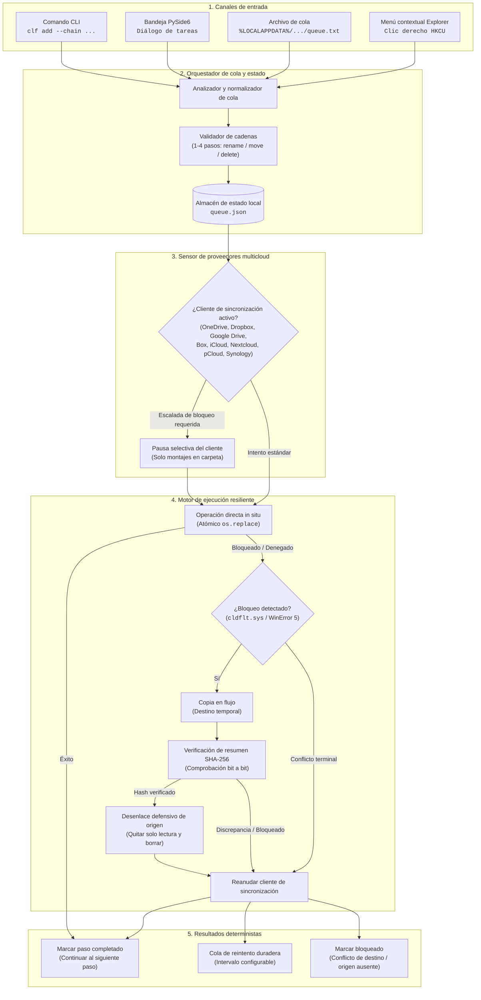
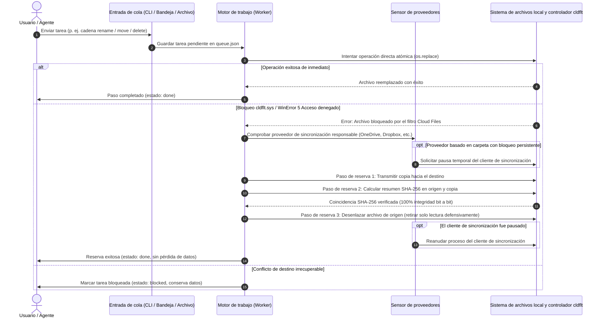

# CloudLockFixer (CLF-WDAS)

[](https://github.com/file-bricks/CloudLockFixer/actions)
[](https://github.com/file-bricks/CloudLockFixer)
[](https://www.python.org/)
[](https://github.com/file-bricks/CloudLockFixer)
[](SECURITY.md)
[](SECURITY.md)
[](LICENSE)
[](https://github.com/file-bricks)
[](https://github.com/open-bricks)
[](pyproject.toml)
[](llms.txt)

> 🌐 **Idiomas:** [English](README.md) | [Deutsch](README.de.md) | [Español](README.es.md)

> [!NOTE]
> **Integración con IA / LLM:** Este repositorio incluye un archivo [`llms.txt`](llms.txt) que proporciona directrices de arquitectura legibles por máquina, interfaces de línea de comandos (CLI) y contratos de seguridad para asistentes de código basados en IA.

**CloudLockFixer** *con servicio de acciones diferidas (CLF-WDAS)* es una herramienta para la bandeja del sistema (system tray) y CLI en Windows que ejecuta operaciones de archivos y carpetas (**renombrar / mover / eliminar**) de forma fiable en carpetas sincronizadas en la nube, incluso cuando el filtro de archivos en la nube de Windows (`cldflt`) las bloquea. Simplemente **pones una acción en cola** y se ejecuta **"eventualmente", de manera automática** — disparar y olvidar (*fire & forget*).

---

## Navegación rápida

- [Resumen](#cloudlockfixer-clf-wdas)
- [Capacidades clave e invariantes de gobernanza](#capacidades-clave-e-invariantes-de-gobernanza)
- [Arquitectura interactiva y ciclo de vida](#arquitectura-interactiva-y-ciclo-de-vida)
  - [Diagrama de flujo de arquitectura](#diagrama-de-flujo-de-arquitectura)
  - [Ciclo de vida de tareas y secuencia de reserva](#ciclo-de-vida-de-tareas-y-secuencia-de-reserva)
- [¿Por qué CloudLockFixer?](#por-qué)
- [Comienza aquí](#comienza-aquí)
- [Características](#características)
- [Proveedores de nube compatibles](#proveedores-de-nube-compatibles)
- [Instalación y guía rápida](#instalación)
- [Guía de uso](#uso)
  - [Aplicación en la bandeja del sistema](#aplicación-en-la-bandeja-del-sistema)
  - [CLI (para LLMs y scripts)](#cli-para-llms-y-scripts)
  - [Archivo de cola (`queue.txt`)](#queuetxt-humanollm)
- [Cómo funciona](#cómo-funciona)
  - [Cadenas de pasos múltiples](#cómo-funciona)
  - [Mecanismo de reserva criptográfico copy+delete](#cómo-funciona)
  - [Worker y protección de proveedores](#cómo-funciona)
- [Matriz del ecosistema hermano](#matriz-del-ecosistema-hermano)
- [Seguridad y privacidad](#seguridad-y-privacidad)
- [Contexto de descubrimiento](#contexto-de-descubrimiento)
- [Estado y hoja de ruta](#estado-y-hoja-de-ruta)
- [Licencia](#licencia)

---

## Capacidades clave e invariantes de gobernanza

| Capacidad / Pilar | Comportamiento e implementación | Invariante de seguridad y gobernanza |
|-------------------|---------------------------------|--------------------------------------|
| **Reserva `copy+delete`** | Cuando Windows `cldflt.sys` bloquea operaciones directas con `WinError 5` / `EXDEV`, CLF transmite el contenido al destino, verifica la coincidencia del hash SHA-256 y desenlaza de forma segura el origen. | **Cero pérdida de datos:** Los archivos de origen nunca se eliminan hasta que el flujo de destino coincide bit a bit. Los atributos de solo lectura se retiran defensivamente antes del borrado. |
| **Cadenas atómicas de pasos múltiples** | Admite secuencias ordenadas de 1 a 4 operaciones (`rename`, `move`, `delete` separadas por `&&`). El paso $N$ se ejecuta estrictamente tras el éxito del paso $N-1$. | **Seguridad condicional:** Las operaciones destructivas (`delete`) jamás se ejecutan si los pasos previos encuentran algún error. |
| **Sensor de proveedores multicloud** | Detecta activamente motores de sincronización para 8 proveedores: OneDrive, Google Drive, Dropbox, Box, iCloud, Nextcloud, pCloud y Synology Drive. | **Pausa selectiva:** Solo las tareas ejecutables con fallos persistentes en proveedores basados en carpetas activan pausas temporales; los montajes virtuales (Google Drive, pCloud) nunca se pausan. |
| **Zero-Egress y Local-First** | Funciona 100% desconectado sin llamadas salientes de red, analíticas ni telemetría hacia APIs externas. | **Aislamiento hermético:** Verificado mediante pruebas de contrato de análisis estático AST (`test_offline_zero_egress_no_network_imports`). |
| **Privilegio mínimo (sin elevación)** | Se ejecuta íntegramente en el espacio de usuario no privilegiado sin requerir credenciales de administrador o root. | **Ámbito confinado:** Las entradas de inicio automático y los menús contextuales de Explorer residen exclusivamente en dominios de usuario (`HKCU`, `~/.config/autostart`, `~/Library/LaunchAgents`). |
| **Motor de reintentos idempotente** | Las tareas realizan transiciones entre `pending`, `done`, `retryable`, `blocked` y `permanent`. Conserva índices de pasos parciales. | **Resiliencia de estado:** Los orígenes faltantes sin destinos se bloquean de forma segura; los movimientos completados siguen siendo éxitos idempotentes en reintentos. |

---

## Arquitectura interactiva y ciclo de vida

### Diagrama de flujo de arquitectura



### Ciclo de vida de tareas y secuencia de reserva



---

## ¿Por qué?

El controlador `cldflt.sys` (instalado por OneDrive, Dropbox, Google Drive, iCloud — cualquier servicio que use la API Cloud Files de Windows) intercepta las llamadas a `rename()` a nivel de controlador y devuelve "Acceso denegado" / `EXDEV` mientras está activo. La **solución recomendada por Microsoft** consiste en reemplazar `rename()` por **`copy()` + `delete()`** — que es exactamente lo que hace esta herramienta, añadiendo reintentos diferidos y pausa opcional del cliente de sincronización.

## Comienza aquí

| Necesidad | Punto de entrada |
|---|---|
| Resolver un bloqueo "Acceso denegado" de OneDrive o Cloud Files | Inicia la aplicación en la bandeja con `START.bat` y añade una tarea diferida |
| Automatizar operaciones bloqueadas desde scripts o agentes LLM | Utiliza `PYTHONPATH=src python -m cloudlockfixer.cli` |
| Inspeccionar el modelo de seguridad antes de borrar nada | Consulta [`docs/DESIGN.md`](docs/DESIGN.md) |
| Encolar trabajo sin abrir la interfaz gráfica | Edita `%LOCALAPPDATA%\CloudLockFixer\queue.txt` |
| Verificar el árbol de fuentes | Ejecuta `PYTHONPATH=src python -m pytest -q` |

## Características

- Pone operaciones de archivos/carpetas en cola y deja que se ejecuten (*fire & forget*).
- Mecanismo de reserva `copy+delete` que esquiva el bloqueo de `cldflt` de forma automática.
- Cadenas de 1 a 4 pasos con ordenación segura: los pasos destructivos solo se ejecutan tras el éxito del paso previo (cero pérdida de datos).
- Múltiples vías de entrada: **CLI** (para LLMs y scripts), **`queue.txt`** legible por humanos, **diálogo de bandeja** y menú contextual del **clic derecho en el Explorador**.
- Reintento automático en un intervalo configurable (por defecto 2 h) y bajo demanda.
- Pausa/reanudación opcional del cliente de sincronización durante una operación para proveedores basados en carpetas compatibles.
- Vigilante preventivo (*watcher*) opcional que pausa/reanuda el cliente de sincronización según la tasa de cambios de carpetas.
- Proveedores de Windows compatibles: OneDrive, Google Drive, Dropbox, Box, iCloud, Nextcloud, pCloud y Synology Drive.
- Inicio automático mediante el registro de Windows, entrada de escritorio XDG en Linux o plist de LaunchAgent en macOS; aplicación de instancia única en bandeja.

## Proveedores de nube compatibles

| Proveedor | Tipo | Mecanismo de detección | Soporte de Pausa/Reanudación |
|-----------|------|------------------------|------------------------------|
| **OneDrive** | Montaje en carpeta | Registro y entorno (`OneDriveConsumer` / `OneDriveCommercial`) | Sí (`OneDrive.exe`) |
| **Dropbox** | Montaje en carpeta | `%LOCALAPPDATA%\Dropbox\info.json` | Sí (`Dropbox.exe`) |
| **Google Drive** | Montaje virtual | Escaneo de letra de unidad montada y Registro | No (Protección segura de montajes virtuales) |
| **Box** | Montaje en carpeta | Registro `HKCU\Software\Box\Box` | Sí (`Box.exe`) |
| **iCloud** | Montaje en carpeta | Raíz predeterminada `%USERPROFILE%\iCloudDrive` | Sí (`iCloudDrive.exe`) |
| **Nextcloud** | Montaje en carpeta | Archivo de configuración `%APPDATA%\Nextcloud\nextcloud.cfg` | Sí (`nextcloud.exe`) |
| **pCloud** | Montaje virtual | Comprobación de etiqueta de volumen (`pCloud`) | No (Protección segura de montajes virtuales) |
| **Synology Drive** | Montaje en carpeta | Configuración `%LOCALAPPDATA%\SynologyDrive\data\session` | Sí (`SynologyDrive.exe`) |

## Instalación

### Requisitos
- Windows (el filtro `cldflt` es específico de Windows; el núcleo headless es compatible con Linux y macOS)
- Python 3.10+
- PySide6 (>= 6.7)

### Pasos
1. Clonar el repositorio
2. `pip install -r requirements.txt`
3. Iniciar la aplicación de bandeja: doble clic en `START.bat`, o
   `PYTHONPATH=src python -m cloudlockfixer`

## Guía de uso

### Aplicación en la bandeja del sistema
Se inicia con Windows cuando el inicio automático está activado. Menú de la bandeja: *Añadir tarea…*, *Ejecutar ahora* (también *con pausa de OneDrive*), *Intervalo* (pasos de 30 min, por defecto 2 h), *Iniciar con Windows*, *Abrir carpeta de datos*. Esta opción abre la carpeta local de la aplicación con `queue.txt` y los archivos de registro. El diálogo para añadir tareas permite elegir si el origen es un archivo o una carpeta.

### CLI (para LLMs y scripts)
```bash
clf add --rename "C:\...\OldFolder" "NewName"
clf add --move   "C:\local\x"        "C:\onedrive\x"
clf add --delete "C:\onedrive\old"
clf add --chain  'move "C:\local\x" "C:\onedrive\x" && delete "C:\onedrive\old"'
clf list
clf retry <id>
clf retry-all
clf run-now [--pause]
```
(Invocación en desarrollo: `PYTHONPATH=src python -m cloudlockfixer.cli ...`)

### queue.txt (humano/LLM)
Un archivo en `%LOCALAPPDATA%\CloudLockFixer\queue.txt`, una línea por tarea (`rename` / `move` / `delete`, encadenamiento con `&&`). Las líneas procesadas se comentan automáticamente con `#>`.

## Cómo funciona

- **Cadenas (1–4 pasos):** El paso N se ejecuta solo tras el éxito del paso N-1. Un `delete` destructivo solo se ejecuta después de que el paso anterior finalizó con éxito → sin pérdida de datos.
- **Primitiva copy+delete:** Primero se intenta una operación directa; ante un bloqueo pasa automáticamente a copiar → verificar → eliminar. Idempotente (seguro para reintentos).
- **Worker:** Se ejecuta al iniciar + cada 2 h (configurable) + bajo demanda. Solo una tarea que falla repetidamente y aún es ejecutable puede pausar el cliente de sincronización responsable durante esa ejecución. Un origen faltante nunca activa la pausa del proveedor: un movimiento o borrado ya completado sigue siendo un éxito idempotente. Los archivos de cola v1 existentes se actualizan in situ en su siguiente ejecución.

---

## Matriz del ecosistema hermano

CloudLockFixer forma parte del ecosistema para escritorio y desarrolladores de **file-bricks** y **open-bricks**:

| Repositorio | Ámbito y especialidad | Rol en el ecosistema | Enlace |
|-------------|-----------------------|----------------------|--------|
| **file-bricks/CloudLockFixer** | Operaciones diferidas de archivos/carpetas y desbloqueo del filtro `cldflt` | Resiliencia del sistema de archivos local | [Repositorio](https://github.com/file-bricks/CloudLockFixer) |
| **file-bricks/SoftwareCenter** | Portafolio de aplicaciones de escritorio y hub del entorno local | Cabina central de la estación de trabajo | [Repositorio](https://github.com/file-bricks/SoftwareCenter) |
| **file-bricks/knowledgedigest** | Motor de indexación y síntesis de conocimiento multifuente | Análisis de documentos de escritorio | [Repositorio](https://github.com/file-bricks/knowledgedigest) |
| **open-bricks** | Ecosistema paraguas de herramientas y software de código abierto | Gobernanza arquitectónica | [Repositorio](https://github.com/open-bricks) |
| **ellmos-ai/system-auditor** | Auditor del sistema multihost e inspector de configuraciones | Verificación operativa | [Repositorio](https://github.com/ellmos-ai/system-auditor) |
| **ellmos-ai/file-collect-sort-action** | Organización declarativa de archivos y automatización del ciclo de vida | Clasificador de archivos basado en invariantes | [Repositorio](https://github.com/ellmos-ai/file-collect-sort-action) |
| **dev-bricks/automizer-for-claude-desktop** | Puesta en escena segura de procesos e inyector de configuración | Automatización de escritorio agéntica | [Repositorio](https://github.com/dev-bricks/automizer-for-claude-desktop) |
| **doc-bricks/USR_pic2pic** | Conversión offline de formatos de imagen y control visual de calidad | Herramientas multimedia locales | [Repositorio](https://github.com/doc-bricks/USR_pic2pic) |
| **doc-bricks/USR_PDFunlock** | Acceso offline a PDF y gestor de seguridad de documentos | Utilidad de procesamiento de documentos | [Repositorio](https://github.com/doc-bricks/USR_PDFunlock) |

---

## Seguridad y privacidad

CloudLockFixer opera bajo una estricta política de seguridad **Zero-Egress & Local-First**:
- **Sin telemetría, analíticas ni llamadas de red:** Verificado mediante inspecciones estáticas automatizadas de importaciones AST en CI (`tests/test_metadata.py`).
- **Integridad criptográfica:** Todos los mecanismos de reserva `copy+delete` calculan hashes SHA-256 para garantizar la integridad de los datos antes de eliminar los originales.
- **Ejecución no privilegiada:** Se ejecuta íntegramente con permisos de usuario (`HKCU`, `~/.config/autostart`).
- Para conocer los procedimientos detallados de divulgación de vulnerabilidades y los SLA de respuesta, consulte [`SECURITY.md`](SECURITY.md).

---

## Contexto de descubrimiento

Frases de búsqueda útiles: `OneDrive access denied rename`, `cldflt.sys locked file`, `Windows Cloud Files filter copy delete fallback`, `OneDrive 0x8007016A file operation`, `Dropbox Google Drive iCloud locked folder retry` y `CloudLockFixer queue.txt`.

CloudLockFixer no es un desbloqueador genérico de archivos, una herramienta antimalware, un cliente de respaldo ni un sustituto del almacenamiento en la nube. Es un asistente de cola y reintento local para archivos que ya están bajo el control del usuario pero temporalmente bloqueados por un proveedor de sincronización en la nube.

## Estado y hoja de ruta

- **P1 (completado):** Núcleo (copy+delete, cadenas, reintento) · CLI (`add`, `list`, `retry`, `retry-all`, `run-now`) · `queue.txt` · Bandeja (con acción de reintento) · Inicio automático · Proveedor de OneDrive.
- **P2 (completado):** Menú contextual del clic derecho de Explorer (cascada en HKCU, opcional mediante selector en la bandeja).
- **P3 (completado):** Vigilante preventivo (supervisa la tasa de cambios de carpetas *configuradas* → pausa/reanuda el cliente de sincronización; acotado, solo estadísticas, no hidrata marcadores de posición online; opcional).
- **Pruebas:** `pytest`, 244 pasadas (núcleo + P2/P3 + reintento/reanudación + i18n Tier-2 + multicloud incl. pCloud/Synology + Box + Nextcloud + bloqueo de manejador propio de directorio vacío + protección de montajes virtuales + escaneo de unidades + reintento duradero por defecto + visibilidad de tareas fallidas + regresiones de bloqueo de proveedor + contratos de directorios entre plataformas, XDG en Linux y LaunchAgent en macOS + suite automatizada de metadatos PEP 621 y zero-egress + pruebas de regresión de renombrado solo de mayúsculas/minúsculas + contratos bilingües de Mermaid y ecosistema).
- **Abierto/futuro:** Más adaptadores de proveedores; supresión opcional de relanzamiento del cliente de sincronización durante operaciones prolongadas.

Windows es el objetivo principal en el alcance empaquetado. El árbol de fuentes está además cubierto por pruebas de humo en Linux/macOS para la ruta principal sin GUI, incluyendo ciclos completos de inicio automático XDG en Linux y LaunchAgent en macOS. Los paquetes nativos y la integración real de clientes en plataformas de destino siguen abiertos.
Notas de diseño: [`docs/DESIGN.md`](docs/DESIGN.md).

## Licencia

MIT — consulte [LICENSE](LICENSE).

Este proyecto depende de **PySide6** (Qt para Python), bajo licencia **LGPL v3**. PySide6 se utiliza como una dependencia de terceros sin modificaciones.
