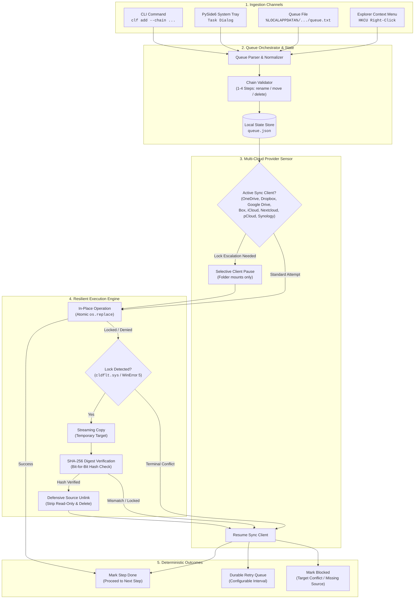
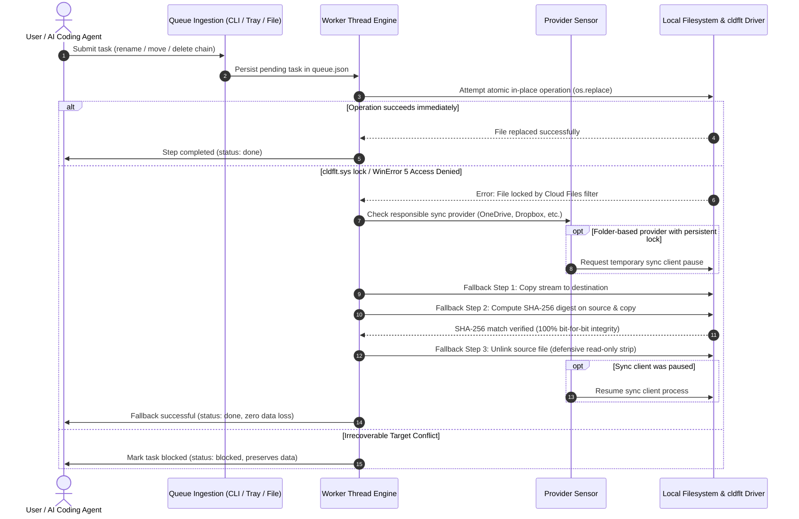

# CloudLockFixer (CLF-WDAS)

[](https://github.com/file-bricks/CloudLockFixer/actions)
[](https://github.com/file-bricks/CloudLockFixer)
[](https://www.python.org/)
[](https://github.com/file-bricks/CloudLockFixer)
[](THIRD_PARTY_LICENSES.md)
[](SECURITY.md)
[](SECURITY.md)
[](LICENSE)
[](THIRD_PARTY_LICENSES.md)
[](https://github.com/file-bricks)
[](https://github.com/open-bricks)
[](pyproject.toml)
[](llms.txt)

> 🌐 **Languages:** [English](README.md) | [Deutsch](README.de.md) | [Español](README.es.md)

> [!NOTE]
> **AI / LLM Integration:** This repository contains an [`llms.txt`](llms.txt) file providing machine-readable architecture guidelines, CLI interfaces, and safety contracts for AI coding assistants.

**CloudLockFixer** *with Delayed Action Service* (CLF-WDAS) is an autonomous Windows system tray and CLI tool that reliably performs file and folder operations (**rename / move / delete**) inside cloud synchronization folders — even when the Windows Cloud Files filter (`cldflt.sys`) or active sync engines are holding transient locks. You **queue an action** and it is carried out **"eventually," automatically** with bit-for-bit SHA-256 verification — fire & forget.

---

## Quick Navigation

1. [Features](#1-features)
2. [Architecture & System Design](#2-architecture--system-design)
3. [Target Personas & Discoverability](#3-target-personas--discoverability)
4. [Comparative Matrix vs. Alternatives](#4-comparative-matrix-vs-alternatives)
5. [Dual Mermaid Diagrams](#5-dual-mermaid-diagrams)
6. [Governance & Runtime Invariants](#6-governance--runtime-invariants)
7. [Multi-Cloud Provider Support](#7-multi-cloud-provider-support)
8. [Cryptographic Copy+Delete Fallback](#8-cryptographic-copydelete-fallback)
9. [Atomic Multi-Step Chains](#9-atomic-multi-step-chains)
10. [Visual Showcase & GUI Workflow](#10-visual-showcase--gui-workflow)
11. [Installation & Quickstart](#11-installation--quickstart)
12. [CLI & Automation Usage](#12-cli--automation-usage)
13. [Queue File (`queue.txt`) Integration](#13-queue-file-queuetxt-integration)
14. [Cross-Platform Parity](#14-cross-platform-parity)
15. [Testing & Quality Verification](#15-testing--quality-verification)
16. [Third-Party Licenses & Transparency](#16-third-party-licenses--transparency)
17. [Sibling Ecosystem Matrix](#17-sibling-ecosystem-matrix)
18. [Security Policy & Statutory Notice](#18-security-policy--statutory-notice)

---

<a id="1-features"></a><a id="features"></a>
## 1. Features

- **Asynchronous Fire & Forget Operations:** Queue file/folder renames, moves, and deletions without blocking interactive work or waiting for locks to release.
- **Bit-for-Bit Cryptographic Copy+Delete Fallback:** When Windows Cloud Files filter (`cldflt.sys`) intercepts atomic renames with `WinError 5` / `EXDEV`, CLF streams bytes to the destination, verifies matching SHA-256 digests, and safely unlinks the source.
- **Ordered Multi-Step Atomic Chains:** Chain 1–4 operations with `&&` (e.g. `move A -> B && delete C`). Subsequent steps execute strictly if prerequisite steps succeed; destructive steps are skipped on upstream errors.
- **Omnichannel Ingestion:** Add tasks via headless **CLI** (`clf add`), plain-text **`queue.txt`**, PySide6 **System Tray Dialog**, or Windows Explorer **Right-Click Context Menu** (`HKCU`).
- **8-Provider Cloud Sensor:** Automatic discovery and intelligent pause/resume for OneDrive, Dropbox, Google Drive, Box, iCloud, Nextcloud, pCloud, and Synology Drive.
- **Virtual Mount Guard:** Distinguishes between folder-mount providers (OneDrive, Dropbox) and virtual-drive mounts (Google Drive, pCloud), strictly preserving virtual mount stability.
- **Deterministic Retry Engine:** Configurable retry interval (default 2 h) and retry limits (`max_retries`). Tasks transition idempotently between `pending`, `retryable`, `blocked`, `failed_permanent`, and `done`.
- **100% Local-First & Zero Egress:** Zero outbound network traffic, zero analytics, zero external sockets. Verified by automated AST static analysis contract tests.
- **Unprivileged Execution (`RunAsInvoker`):** Runs purely in user space without requiring administrator elevation, UAC prompts, or kernel-mode drivers.

---

<a id="2-architecture--system-design"></a><a id="2-architecture"></a><a id="architecture"></a><a id="interactive-architecture--lifecycle"></a>
## 2. Architecture & System Design

For in-depth architectural specifications and safety models, see [docs/DESIGN.md](docs/DESIGN.md).

Windows Cloud Files mini-filter driver (`cldflt.sys`) acts as a filesystem filter for cloud sync engines (OneDrive, Dropbox, iCloud, Nextcloud, etc.). When a file is undergoing hydration, thumbnail extraction, or background replication, `cldflt.sys` intercepts standard Win32 `rename()` and `MoveFileEx()` calls, returning `ERROR_ACCESS_DENIED` (`WinError 5`) or cross-device link errors (`EXDEV`).

```
[User / Agent Task]
       │
       ▼
[Queue Normalizer] ───► [queue.json Store]
                              │
                              ▼
                      [Worker Thread Engine]
                              │
               ┌──────────────┴──────────────┐
               ▼                             ▼
        [Direct In-Place]            [Provider Sensor]
        (os.replace / atomic)        (OneDrive, Dropbox, etc.)
               │                             │
          Lock Detected?                     │
               │ (WinError 5 / cldflt)       ▼
               ▼                     [Selective Pause]
        [Copy+Delete Fallback]       (Folder mounts only)
        1. Stream to target                  │
        2. SHA-256 Digest Match              ▼
        3. Defensive Source Unlink   [Resume Sync Engine]
```

Microsoft's documented guidance for handling filter-driver sharing violations is replacing single-operation renames with verified **copy-and-delete** semantics. CloudLockFixer implements this pattern alongside durable disk queues, exponential backoff, process synchronization, and clean rollback safety.

---

<a id="3-target-personas--discoverability"></a><a id="target-personas"></a>
## 3. Target Personas & Discoverability

CloudLockFixer addresses four distinct user personas:

- **`[PERSONA-01]` Desktop Power Users & Cloud Sync Workers:**
  - *Context:* Managing daily project files inside OneDrive, Dropbox, Google Drive, or Nextcloud folders.
  - *Pain Point:* Constant interruptions from *"The action can't be completed because the file is open in another program"* during active sync cycles.
  - *Benefit:* Silent background resolution via the system tray; queue a rename or cleanup and continue working without interruptions.
- **`[PERSONA-02]` Autonomous AI Coding Agents & LLM Script Developers:**
  - *Context:* AI coding assistants (Antigravity, Claude Code, Codex) executing repository refactors and file migrations.
  - *Pain Point:* Fragile shell scripts crash when trying to move or delete files in cloud-synced local repositories.
  - *Benefit:* Headless CLI (`clf add --chain ...`), human/agent readable `queue.txt`, and structured `llms.txt` integration with 100% predictable exit codes.
- **`[PERSONA-03]` DevOps Engineers, System Administrators & CI/CD Builders:**
  - *Context:* Maintaining multi-host developer workstations, automated test runners, and scheduled build cleanups.
  - *Pain Point:* Build steps intermittently fail due to file locks on temporary test directories and build caches.
  - *Benefit:* Multi-step atomic chains (`op1 && op2 && op3`), configurable retry limits, and cross-platform core support across Windows, Linux, and macOS.
- **`[PERSONA-04]` Open Source Maintainers, Security Auditors & File System Enthusiasts:**
  - *Context:* Organizations requiring verified offline-first software without proprietary kernel drivers.
  - *Pain Point:* Third-party file unlockers frequently bundle closed-source kernel drivers, ask for root/admin elevation, or ship adware.
  - *Benefit:* Completely transparent MIT-licensed codebase, dynamic linking LGPL-3.0 isolation, zero-egress guarantee, and non-elevated `RunAsInvoker` mode.

### High-Intent Search Queries

| Query Theme | Target English Search Query | Target German Search Query |
|---|---|---|
| **OneDrive Lock** | `onedrive file locked cannot rename move delete fix` | `onedrive datei gesperrt umbenennen fehler beheben` |
| **Driver Lock** | `cldflt.sys file in use error python workaround` | `cldflt fehler 0x8007016A datei verschieben` |
| **Delayed Queue** | `windows delayed action file queue open source` | `cloud sync dateisperre automatisches verzögertes verschieben` |
| **Safe Fallback** | `copy delete fallback file unlocker python` | `datei wird von einem anderen prozess verwendet cloud sync` |
| **Agent Tooling** | `automated file rename queue for ai coding agents` | `python dateisystem queue ohne admin rechte` |

---

<a id="4-comparative-matrix-vs-alternatives"></a><a id="comparative-matrix"></a>
## 4. Comparative Matrix vs. Alternatives

| Feature / Dimension | CloudLockFixer (CLF-WDAS) | Windows Explorer / Shell | LockHunter / Unlocker | Generic Sleep Scripts | Cloud Sync Web UIs | Invariant Alignment |
|---|---|---|---|---|---|---|
| **Non-Destructive Copy+Delete** | :white_check_mark: Bit-for-bit SHA-256 verified | :x: Fails on lock (`WinError 5`) | :x: Force-closes handles | :warning: Unverified copy | :x: Not applicable | `INV-HASH-03` |
| **Kernel Filter Awareness** | :white_check_mark: Tailored for `cldflt.sys` | :x: Blocks immediately | :warning: Generic handle kill | :x: None (blind retry) | :x: None | `INV-SENSOR-05` |
| **Multi-Step Atomic Chains** | :white_check_mark: 1–4 steps (`&&`) with halt | :x: None | :x: Single file only | :warning: Fragile custom logic | :x: None | `INV-CHAIN-04` |
| **Privilege Requirement** | :white_check_mark: Unprivileged (`RunAsInvoker`) | :white_check_mark: User mode | :x: Kernel Driver / Admin UAC | :white_check_mark: User mode | :white_check_mark: Browser session | `INV-RUNAS-02` |
| **Multi-Cloud Sensor** | :white_check_mark: 8 providers auto-detected | :x: None | :x: None | :x: None | :x: Single cloud silo | `INV-SENSOR-05` |
| **Zero Egress & Telemetry** | :white_check_mark: 100% Offline (AST tested) | :x: Telemetry enabled | :x: Closed source / Adware risk | :white_check_mark: Local script | :x: Full cloud egress | `INV-LOCAL-01` |
| **Headless AI / CLI Interface** | :white_check_mark: `clf add` + `queue.txt` + `llms.txt` | :warning: PowerShell only | :x: GUI only | :warning: Custom CLI | :x: Web UI only | `INV-DOCS-09` |
| **Single-Instance System Tray** | :white_check_mark: PySide6 Tray + Dialogs | :x: None | :white_check_mark: GUI window | :x: None | :x: None | `INV-PLAT-08` |
| **Deterministic Retry Model** | :white_check_mark: Configurable backoff & states | :x: Manual retry modal | :x: Immediate kill | :warning: Hardcoded sleep loop | :x: Cloud eventual | `INV-IDEMP-06` |
| **Security SLA & Support** | :white_check_mark: 48h SLA / 5d Triage | :x: Standard OS support | :x: Abandonware / Unmaintained | :x: None (unmaintained) | :x: Enterprise portal | `INV-SLA-10` |

---

<a id="5-dual-mermaid-diagrams"></a><a id="mermaid-diagrams"></a>
## 5. Dual Mermaid Diagrams

### System Architecture Flowchart



### End-to-End Task Lifecycle Sequence Diagram



---

<a id="6-governance--runtime-invariants"></a><a id="governance-invariants"></a><a id="key-capabilities--governance-invariants"></a>
## 6. Governance & Runtime Invariants

| Invariant | Category | Behavior & Implementation | Governance & Safety Invariant |
|---|---|---|---|
| `INV-LOCAL-01` | Local-First & Zero Egress | 100% offline-first execution with zero external network calls, tracking, analytics, or telemetry. | **Hermetic Isolation:** Enforced and verified via AST static analysis contract tests (`test_offline_zero_egress_no_network_imports`). |
| `INV-RUNAS-02` | Unprivileged User Mode | Runs entirely in unprivileged user space (`RunAsInvoker`). | **Confined Scope:** Autostart registry keys and context menus live purely within `HKCU` without UAC prompts or root requirements. |
| `INV-HASH-03` | Cryptographic Copy+Delete | When `cldflt.sys` blocks atomic moves, CLF streams content to destination and verifies matching SHA-256 hashes. | **Zero Data Loss:** Source files are never unlinked until destination digest matches bit-for-bit. |
| `INV-CHAIN-04` | Atomic Multi-Step Chains | Supports ordered chains of 1–4 operations (`rename`, `move`, `delete` separated by `&&`). | **Conditional Safety:** Step $N$ executes strictly after Step $N-1$ succeeds. Destructive operations abort if prior steps fail. |
| `INV-SENSOR-05` | Multi-Cloud Engine Sensor | Automatically inspects and detects 8 cloud sync engines: OneDrive, Dropbox, Google Drive, Box, iCloud, Nextcloud, pCloud, Synology Drive. | **Selective Pause:** Only folder-backed sync engines are temporarily paused during persistent locks; virtual mounts are never paused. |
| `INV-IDEMP-06` | Deterministic Idempotent Retry | Tasks transition between `pending`, `done`, `retryable`, `blocked`, and `failed_permanent`. | **State Resilience:** Missing sources without targets are safely blocked; already completed tasks remain idempotent successes. |
| `INV-TRIM-07` | Defensive Source & Read-Only Handling | Read-only attributes are stripped defensively prior to deletion; case-only renames are safely handled on case-insensitive filesystems. | **Filesystem Cleanliness:** Protects against locked read-only remnants and corrupt intermediate states. |
| `INV-PLAT-08` | Cross-Platform Foundation | Cross-platform core and data directory logic supporting Windows, Linux (XDG autostart), and macOS (LaunchAgents). | **Platform Parity:** Core queue and worker run cleanly across all major desktop operating systems. |
| `INV-DOCS-09` | 1:1 Bilingual Documentation | Symmetrical 18-point documentation parity across English (`README.md`) and German (`README.de.md`) backed by `llms.txt`. | **Architectural Transparency:** Complete operational guidelines accessible to both human developers and autonomous AI coding agents. |
| `INV-SLA-10` | Open Source Governance & SLA | MIT License, public GitHub issue tracker, and committed security SLA. | **Security Commitment:** 48-hour initial response SLA and 5-business-day triage commitment documented in `SECURITY.md`. |

---

<a id="7-multi-cloud-provider-support"></a><a id="cloud-providers"></a><a id="supported-cloud-providers"></a>
## 7. Multi-Cloud Provider Support

CloudLockFixer detects and manages synchronization engines across 8 major cloud providers:

| Provider | Mount Type | Detection Mechanism | Pause/Resume Support | Safety Policy |
|---|---|---|---|---|
| **OneDrive** | Folder Mount | Registry & Environment (`OneDriveConsumer` / `OneDriveCommercial`) | Yes (`OneDrive.exe`) | Pauses only during persistent lock on folder-backed paths |
| **Dropbox** | Folder Mount | `%LOCALAPPDATA%\Dropbox\info.json` | Yes (`Dropbox.exe`) | Pauses only during persistent lock on folder-backed paths |
| **Google Drive** | Virtual Mount | Mounted drive letter scan & Registry | No (Safe Virtual Mount Guard) | Virtual drive mount — never paused to prevent drive unmount crashes |
| **Box** | Folder Mount | Registry `HKCU\Software\Box\Box` | Yes (`Box.exe`) | Pauses only during persistent lock on folder-backed paths |
| **iCloud** | Folder Mount | Default root `%USERPROFILE%\iCloudDrive` | Yes (`iCloudDrive.exe`) | Pauses only during persistent lock on folder-backed paths |
| **Nextcloud** | Folder Mount | Config file `%APPDATA%\Nextcloud\nextcloud.cfg` | Yes (`nextcloud.exe`) | Pauses only during persistent lock on folder-backed paths |
| **pCloud** | Virtual Mount | Volume label check (`pCloud`) | No (Safe Virtual Mount Guard) | Virtual drive mount — never paused to prevent drive unmount crashes |
| **Synology Drive** | Folder Mount | Config `%LOCALAPPDATA%\SynologyDrive\data\session` | Yes (`SynologyDrive.exe`) | Pauses only during persistent lock on folder-backed paths |

---

<a id="8-cryptographic-copydelete-fallback"></a><a id="copy-delete-fallback"></a>
## 8. Cryptographic Copy+Delete Fallback

When operating in cloud-synchronized directories, `os.replace()` or `MoveFileEx()` frequently encounters `ERROR_SHARING_VIOLATION` or `cldflt` filter blocks. CloudLockFixer resolves this via a 3-phase verified sequence:

1. **Streaming Copy:** Streams file or directory contents to a temporary destination using buffered I/O.
2. **Cryptographic SHA-256 Digest Verification:** Computes the SHA-256 hash of both source and target files. If any bit mismatch is detected, the operation aborts immediately and the target is discarded.
3. **Defensive Source Removal:** Strips read-only file attributes and removes the source. If removal fails, the target is preserved and the operation enters the retry queue.

---

<a id="9-atomic-multi-step-chains"></a><a id="multi-step-chains"></a>
## 9. Atomic Multi-Step Chains

CloudLockFixer supports chaining up to 4 sequential operations using the `&&` operator:

```bash
clf add --chain 'move "C:\local\build.bin" "C:\onedrive\build.bin" && delete "C:\onedrive\old.bin"'
```

- **Strict Prerequisite Execution:** Step $N$ executes strictly after Step $N-1$ reports status `done`.
- **Fail-Safe Abort:** If an intermediate step fails or encounters a target conflict, the remaining steps are skipped, preventing destructive deletions of un-migrated data.
- **Persistent Progress:** Progress is preserved in `queue.json`, allowing resumed tasks to continue from the exact failed step without re-executing completed operations.

---

<a id="10-visual-showcase--gui-workflow"></a><a id="gui-workflow"></a><a id="tray-app"></a>
## 10. Visual Showcase & GUI Workflow

### PySide6 System Tray Interface
CloudLockFixer runs quietly in the Windows notification area (System Tray). Key tray menu features:
- **Add Task Dialog:** Intuitive GUI dialog allowing users to browse for files or folders and select delayed actions (`Rename`, `Move`, `Delete`).
- **Run Now:** Triggers immediate processing of all pending queue items (with optional one-click sync client pause).
- **Retry Controls:** View and re-trigger individual failed tasks or trigger `Retry All`.
- **Configurable Interval:** Adjust worker background cycle (30-min intervals up to 12 hours; default 2 h).
- **Max Retries:** Configure retry limits (Unlimited, 3, 5, 10, 20 attempts).
- **Desktop Notifications:** Toggle native Windows toast notifications on permanent task failure or block.
- **Autostart with Windows:** Toggles `HKCU` registry autostart entry without admin privileges.
- **Open Data Folder:** Direct access to `%LOCALAPPDATA%\CloudLockFixer` containing `queue.txt`, `queue.json`, and runtime logs.

---

<a id="11-installation--quickstart"></a><a id="installation"></a><a id="start-here"></a>
## 11. Installation & Quickstart

### Prerequisites
- **Operating System:** Windows 10/11 (for `cldflt.sys` filter resolution and Explorer integration; headless Linux/macOS supported).
- **Python:** Version 3.10, 3.11, 3.12, or 3.13.
- **GUI Engine:** PySide6 (`>=6.7.0`).

### Quickstart Steps
```bash
# 1. Clone the repository
git clone https://github.com/file-bricks/CloudLockFixer.git
cd CloudLockFixer

# 2. Install dependencies
pip install -r requirements.txt

# 3. Launch the System Tray application
START.bat
# Or via Python module directly:
PYTHONPATH=src python -m cloudlockfixer
```

---

<a id="12-cli--automation-usage"></a><a id="cli-usage"></a><a id="cli-for-llmsscripts"></a>
## 12. CLI & Automation Usage

CloudLockFixer provides a rich CLI interface designed for developers, automation scripts, and autonomous AI coding agents:

```bash
# Add single operations
clf add --rename "C:\OneDrive\Project" "Project_Archived"
clf add --move   "C:\Local\Artifacts"  "C:\OneDrive\Artifacts"
clf add --delete "C:\OneDrive\TempCache"

# Add atomic multi-step chain
clf add --chain  'move "C:\Build\bin" "C:\OneDrive\bin" && delete "C:\OneDrive\old_bin"'

# Inspect queue status
clf list

# Retry failed or blocked tasks
clf retry <task-id>
clf retry-all

# Execute queue immediately
clf run-now
clf run-now --pause
clf run-now --max-retries 5

# Diagnostics
clf diagnose
```

*(Development invocation: `PYTHONPATH=src python -m cloudlockfixer.cli ...`)*

---

<a id="13-queue-file-queuetxt-integration"></a><a id="queue-file"></a><a id="queuetxt-humanllm"></a>
## 13. Queue File (`queue.txt`) Integration

For scriptless or human-friendly queuing, CloudLockFixer continuously watches the plain-text queue file at:
`%LOCALAPPDATA%\CloudLockFixer\queue.txt`

Lines are formatted as standard commands:
```text
rename "C:\OneDrive\OldName" "NewName"
move "C:\Temp\Data.zip" "C:\OneDrive\Data.zip"
delete "C:\OneDrive\ObsoleteFolder"
move "C:\Src\A" "C:\Dst\A" && delete "C:\Dst\Old"
```

When processed by the background worker, completed lines are atomically commented out with `#>` and timestamped, preserving a human-auditable execution log.

---

<a id="14-cross-platform-parity"></a><a id="cross-platform"></a>
## 14. Cross-Platform Parity

While `cldflt.sys` filter mitigation is specific to Windows, CloudLockFixer features a fully decoupled, cross-platform architecture:
- **Windows:** Standard native runtime utilizing `HKCU` registry entries, Win32 error codes, and Explorer right-click integration.
- **Linux:** Headless execution with XDG Base Directory specification compliance (`$XDG_DATA_HOME/cloudlockfixer`), `.desktop` autostart entries (`~/.config/autostart`), GNOME/Nautilus scripts (`~/.local/share/nautilus/scripts/CloudLockFixer`), and KDE/Dolphin ServiceMenus (`~/.local/share/kio/servicemenus/cloudlockfixer.desktop`).
- **macOS:** Headless execution with standard `~/Library/Application Support/CloudLockFixer` data directory, User LaunchAgent plists (`~/Library/LaunchAgents`), and Finder Quick Actions / Services workflows (`~/Library/Services/`).

---

<a id="15-testing--quality-verification"></a><a id="testing"></a>
## 15. Testing & Quality Verification

The repository enforces strict continuous verification with 285 automated tests (`pytest`, 285 passing, 0 failures, 100% green):

```bash
# Run the complete test suite
PYTHONIOENCODING=utf-8 python -m pytest -ra -v

# Run code style and lint inspection
ruff check .

# Run bytecode compilation verification
python -m compileall -q src tests

# Run cross-platform source smoke tests
python -m pytest tests/source_platform_smoke.py -v
```

Test coverage includes unit tests, audit fixes, multi-step chains, crypto-hash verification, provider sensor mock suites, cross-platform autostart roundtrips, zero-egress AST static analysis, and PEP 621 metadata contract tests.

---

<a id="16-third-party-licenses--transparency"></a><a id="third-party-licenses"></a><a id="license"></a>
## 16. Third-Party Licenses & Transparency

CloudLockFixer is open source software licensed under the permissive [MIT License](LICENSE).

All runtime and development dependencies are rigorously tracked and audited in [`THIRD_PARTY_LICENSES.md`](THIRD_PARTY_LICENSES.md):
- **PySide6 & shiboken6:** Licensed under **LGPL-3.0-only**. PySide6 is used as an unmodified dynamically linked dependency via official CPython wheels.
- **Zero-Copyleft Isolation:** No proprietary GPL/AGPL source code is bundled into the application core.
- **Unprivileged Certification:** Runs purely in user space (`RunAsInvoker`) without administrative privileges.

---

<a id="17-sibling-ecosystem-matrix"></a><a id="sibling-ecosystem"></a><a id="sibling-ecosystem-matrix"></a>
## 17. Sibling Ecosystem Matrix

CloudLockFixer integrates into the **file-bricks** and **open-bricks** desktop and developer ecosystem:

| Repository | Scope & Specialty | Role in Ecosystem | Link |
|---|---|---|---|
| **file-bricks/CloudLockFixer** | Delayed file/folder operations & `cldflt` filter unlocker | Local filesystem resilience | [Repository](https://github.com/file-bricks/CloudLockFixer) |
| **file-bricks/SoftwareCenter** | Desktop application portfolio and local environment hub | Central workstation cockpit | [Repository](https://github.com/file-bricks/SoftwareCenter) |
| **file-bricks/knowledgedigest** | Multi-source knowledge indexing and digest engine | Desktop document analysis | [Repository](https://github.com/file-bricks/knowledgedigest) |
| **open-bricks** | Umbrella open-source software and tooling collective | Architectural governance | [Repository](https://github.com/open-bricks) |
| **ellmos-ai/system-auditor** | Multi-host system auditor and configuration inspector | Operational verification | [Repository](https://github.com/ellmos-ai/system-auditor) |
| **ellmos-ai/file-collect-sort-action** | Declarative file organization and lifecycle automation | Invariant-driven file sorter | [Repository](https://github.com/ellmos-ai/file-collect-sort-action) |
| **dev-bricks/automizer-for-claude-desktop** | Safe process staging and configuration injector | Agentic desktop automation | [Repository](https://github.com/dev-bricks/automizer-for-claude-desktop) |
| **doc-bricks/USR_pic2pic** | Offline image format conversion and visual QA | Local-first media tooling | [Repository](https://github.com/doc-bricks/USR_pic2pic) |
| **doc-bricks/USR_PDFunlock** | Offline PDF access and document security manager | Document processing utility | [Repository](https://github.com/doc-bricks/USR_PDFunlock) |

---

<a id="18-security-policy--statutory-notice"></a><a id="security-policy"></a><a id="security--privacy"></a>
## 18. Security Policy & Statutory Notice

CloudLockFixer operates under strict security and privacy guarantees:
- **100% Local-First & Zero-Egress:** The tool performs no telemetry, analytics, or outbound internet communication. Details: [`PRIVACY_POLICY.md`](PRIVACY_POLICY.md).
- **Cryptographic Verification:** SHA-256 verification ensures that files are never lost during copy+delete fallbacks.
- **Vulnerability SLA:** Coordinated vulnerability disclosure with a committed 48-hour initial response and 5-business-day triage SLA detailed in [`SECURITY.md`](SECURITY.md).
- **Support & Troubleshooting:** Issue reporting guidelines and contact channels are detailed in [`SUPPORT.md`](SUPPORT.md).
- **Windows Store & Packaging:** Preparation guide and metadata for Microsoft Store submission are documented in [`WINDOWS_STORE_PREP.md`](WINDOWS_STORE_PREP.md) and [`STORE_LISTING.md`](STORE_LISTING.md).
