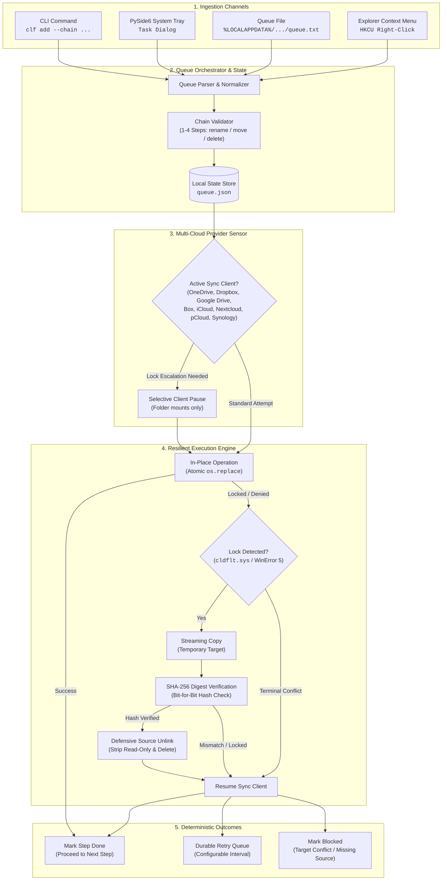
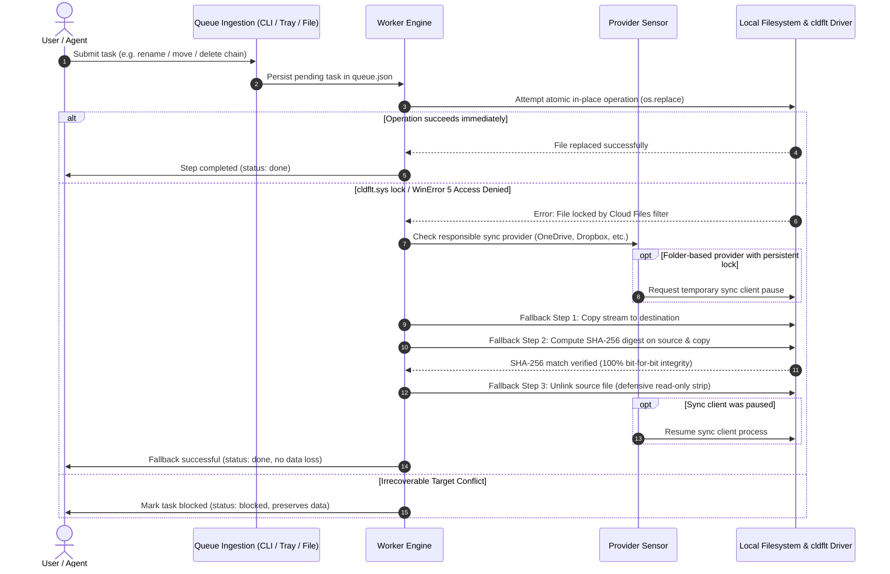

# CloudLockFixer (CLF-WDAS)

[](https://github.com/file-bricks/CloudLockFixer/actions)
[](https://github.com/file-bricks/CloudLockFixer)
[](https://www.python.org/)
[](https://github.com/file-bricks/CloudLockFixer)
[](SECURITY.md)
[](SECURITY.md)
[](LICENSE)
[](https://github.com/file-bricks)
[](https://github.com/open-bricks)
[](pyproject.toml)
[](llms.txt)

> 🌐 **Languages:** [English](README.md) | [Deutsch](README.de.md) | [Español](README.es.md)

> [!NOTE]
> **AI / LLM Integration:** This repository contains an [`llms.txt`](llms.txt) file providing machine-readable architecture guidelines, CLI interfaces, and safety contracts for AI coding assistants.

**CloudLockFixer** *with Delayed Action Service* is a Windows tray and CLI tool that
reliably performs file/folder operations (**rename / move / delete**) inside
cloud-sync folders — even while the Windows Cloud Files filter (`cldflt`) is
blocking them. You **queue an action** and it is carried out **"eventually,"
automatically** — fire & forget.

---

## Quick Navigation

- [Overview](#cloudlockfixer-clf-wdas)
- [Key Capabilities & Governance Invariants](#key-capabilities--governance-invariants)
- [Interactive Architecture & Lifecycle](#interactive-architecture--lifecycle)
  - [Architecture Flowchart](#architecture-flowchart)
  - [Task Lifecycle & Fallback Sequence](#task-lifecycle--fallback-sequence)
- [Why CloudLockFixer?](#why)
- [Start Here](#start-here)
- [Features](#features)
- [Supported Cloud Providers](#supported-cloud-providers)
- [Installation & Quickstart](#installation)
- [Usage Guide](#usage)
  - [System Tray App](#tray-app)
  - [CLI (for LLMs & Scripts)](#cli-for-llmsscripts)
  - [Queue File (`queue.txt`)](#queuetxt-humanllm)
- [How It Works](#how-it-works)
  - [Multi-Step Chains](#how-it-works)
  - [Cryptographic Copy+Delete Fallback](#how-it-works)
  - [Worker & Provider Guard](#how-it-works)
- [Sibling Ecosystem Matrix](#sibling-ecosystem-matrix)
- [Security & Privacy](#security--privacy)
- [Discovery Context](#discovery-context)
- [Status & Roadmap](#status--roadmap)
- [License](#license)

---

## Key Capabilities & Governance Invariants

| Capability / Pillar | Behavior & Implementation | Governance & Safety Invariant |
|---------------------|---------------------------|-------------------------------|
| **`copy+delete` Fallback** | When Windows `cldflt.sys` blocks in-place operations with `WinError 5` / `EXDEV`, CLF automatically streams content to destination, computes SHA-256 digest match, and safely unlinks source. | **Zero Data Loss:** Source files are never unlinked until the destination stream matches bit-for-bit. Read-only flags are stripped defensively before deletion. |
| **Atomic Multi-Step Chains** | Supports ordered chains of 1–4 operations (`rename`, `move`, `delete` separated by `&&`). Step $N$ executes strictly after Step $N-1$ succeeds. | **Conditional Safety:** Destructive operations (`delete`) never execute if previous prerequisite steps encounter an error. |
| **Multi-Cloud Provider Sensor** | Actively detects sync engines for 8 providers: OneDrive, Google Drive, Dropbox, Box, iCloud, Nextcloud, pCloud, and Synology Drive. | **Selective Pause:** Only persistently failing, executable tasks in folder-backed providers trigger temporary sync pauses; virtual mounts (Google Drive, pCloud) are never paused. |
| **Zero-Egress & Local-First** | Runs 100% offline with zero outbound network calls, analytics, or external API telemetry. | **Hermetic Isolation:** Verified by AST static analysis contract tests (`test_offline_zero_egress_no_network_imports`). |
| **Least Privilege (Non-Elevation)** | Runs entirely in unprivileged user space without requiring administrator or root credentials. | **Confined Scope:** Autostart entries and Explorer context menus live solely in user domains (`HKCU`, `~/.config/autostart`, `~/Library/LaunchAgents`). |
| **Idempotent Retry Engine** | Tasks transition between `pending`, `done`, `retryable`, `blocked`, and `permanent`. Preserves partial step indices. | **State Resilience:** Missing sources without targets are safely blocked; completed moves remain idempotent successes on replay. |

---

## Interactive Architecture & Lifecycle

### Architecture Flowchart



### Task Lifecycle & Fallback Sequence



---

## Why?

`cldflt.sys` (installed by OneDrive, Dropbox, Google Drive, iCloud — anything
using the Cloud Files API) intercepts `rename()` at the driver level and
returns "Access denied"/EXDEV while it is active. The **Microsoft-recommended
workaround** is to replace `rename()` with **copy()+delete()** — which is
exactly what this tool does, plus delayed retries and optional pausing of the
sync client.

## Start here

| Need | Entry point |
|---|---|
| Fix a OneDrive or Cloud Files "Access denied" rename/move/delete | Start the tray app with `START.bat`, then add a delayed task |
| Automate stuck file operations from scripts or LLM agents | Use `PYTHONPATH=src python -m cloudlockfixer.cli` |
| Inspect the safety model before deleting anything | Read [`docs/DESIGN.md`](docs/DESIGN.md) |
| Queue work without opening the UI | Edit `%LOCALAPPDATA%\CloudLockFixer\queue.txt` |
| Verify the source tree | Run `PYTHONPATH=src python -m pytest -q` |

## Features

- Queue file/folder operations and let them run fire & forget
- `copy+delete` fallback that bypasses the `cldflt` lock automatically
- Chains of 1–4 steps with safe ordering — destructive steps run only after the
  preceding step succeeds (no data loss)
- Multiple input paths: **CLI** (for LLMs/scripts), human-readable
  **`queue.txt`**, **tray dialog**, and an **Explorer right-click** context menu
- Auto-retry on a configurable interval (default 2 h) and on demand
- Optional sync-client pause/restart during an operation for supported
  folder-based providers
- Optional preventive watcher that pauses/resumes the sync client based on
  folder activity
- Supported Windows providers today: OneDrive, Google Drive, Dropbox, Box,
  iCloud, Nextcloud, pCloud, and Synology Drive
- Autostart via the Windows registry, a Linux XDG desktop entry, or a macOS
  LaunchAgent plist; single-instance tray app

## Supported Cloud Providers

| Provider | Type | Detection Mechanism | Pause/Resume Support |
|----------|------|---------------------|----------------------|
| **OneDrive** | Folder Mount | Registry & Environment (`OneDriveConsumer` / `OneDriveCommercial`) | Yes (`OneDrive.exe`) |
| **Dropbox** | Folder Mount | `%LOCALAPPDATA%\Dropbox\info.json` | Yes (`Dropbox.exe`) |
| **Google Drive** | Virtual Mount | Mounted drive letter scan & Registry | No (Safe Virtual Mount Guard) |
| **Box** | Folder Mount | Registry `HKCU\Software\Box\Box` | Yes (`Box.exe`) |
| **iCloud** | Folder Mount | Default root `%USERPROFILE%\iCloudDrive` | Yes (`iCloudDrive.exe`) |
| **Nextcloud** | Folder Mount | Config file `%APPDATA%\Nextcloud\nextcloud.cfg` | Yes (`nextcloud.exe`) |
| **pCloud** | Virtual Mount | Volume label check (`pCloud`) | No (Safe Virtual Mount Guard) |
| **Synology Drive** | Folder Mount | Config `%LOCALAPPDATA%\SynologyDrive\data\session` | Yes (`SynologyDrive.exe`) |

## Installation

### Requirements
- Windows (the `cldflt` filter is Windows-specific; Linux/macOS headless core supported)
- Python 3.10+
- PySide6 (>= 6.7)

### Steps
1. Clone the repository
2. `pip install -r requirements.txt`
3. Start the tray app: double-click `START.bat`, or
   `PYTHONPATH=src python -m cloudlockfixer`

## Usage

### Tray app
Starts with Windows when autostart is enabled. Tray menu: *Add task…*,
*Run now* (also *with OneDrive pause*), *Interval* (30-min steps, default 2 h),
*Start with Windows*, *Open data folder*. That entry opens the local app folder
with `queue.txt` and the log files, instead of pretending to open a specific
queue/log view. The add-task dialog now lets you choose whether the source is a
file or a folder, so the GUI matches the documented file/folder workflow.

### CLI (for LLMs/scripts)
```bash
clf add --rename "C:\...\OldFolder" "NewName"
clf add --move   "C:\local\x"        "C:\onedrive\x"
clf add --delete "C:\onedrive\old"
clf add --chain  'move "C:\local\x" "C:\onedrive\x" && delete "C:\onedrive\old"'
clf list
clf retry <id>
clf retry-all
clf run-now [--pause]
```
(dev invocation: `PYTHONPATH=src python -m cloudlockfixer.cli ...`)

### queue.txt (human/LLM)
A file at `%LOCALAPPDATA%\CloudLockFixer\queue.txt`, one line per task
(`rename` / `move` / `delete`, chaining with `&&`). Consumed lines are
automatically commented out with `#>`.

## How it works

- **Chains (1–4 steps):** step N runs only after step N-1 succeeds. A
  destructive `delete` runs only after its preceding step succeeded → no data
  loss.
- **copy+delete primitive:** an in-place attempt is made first; on a lock it
  automatically falls back to copy → verify → delete. Idempotent (safe to
  retry).
- **Worker:** runs on start + every 2 h (configurable) + on demand. Only a
  repeatedly failing, still executable task may pause the responsible sync
  client for that run. A missing current source never triggers a provider
  pause: an already completed move or delete stays an idempotent success, while
  a move/rename with no source or target is blocked by normal execution.
  Existing v1 queue files are updated in place on their next run.

---

## Sibling Ecosystem Matrix

CloudLockFixer is part of the **file-bricks** and **open-bricks** desktop and developer ecosystem:

| Repository | Scope & Specialty | Role in Ecosystem | Link |
|------------|-------------------|-------------------|------|
| **file-bricks/CloudLockFixer** | Delayed file/folder operations & `cldflt` filter unlocker | Local filesystem resilience | [Repository](https://github.com/file-bricks/CloudLockFixer) |
| **file-bricks/SoftwareCenter** | Desktop application portfolio and local environment hub | Central workstation cockpit | [Repository](https://github.com/file-bricks/SoftwareCenter) |
| **file-bricks/knowledgedigest** | Multi-source knowledge indexing and digest engine | Desktop document analysis | [Repository](https://github.com/file-bricks/knowledgedigest) |
| **open-bricks** | Umbrella open-source software and tooling ecosystem | Architectural governance | [Repository](https://github.com/open-bricks) |
| **ellmos-ai/system-auditor** | Multi-host system auditor and configuration inspector | Operational verification | [Repository](https://github.com/ellmos-ai/system-auditor) |
| **ellmos-ai/file-collect-sort-action** | Declarative file organization and lifecycle automation | Invariant-driven file sorter | [Repository](https://github.com/ellmos-ai/file-collect-sort-action) |
| **dev-bricks/automizer-for-claude-desktop** | Safe process staging and configuration injector | Agentic desktop automation | [Repository](https://github.com/dev-bricks/automizer-for-claude-desktop) |
| **doc-bricks/USR_pic2pic** | Offline image format conversion and visual QA | Local-first media tooling | [Repository](https://github.com/doc-bricks/USR_pic2pic) |
| **doc-bricks/USR_PDFunlock** | Offline PDF access and document security manager | Document processing utility | [Repository](https://github.com/doc-bricks/USR_PDFunlock) |

---

## Security & Privacy

CloudLockFixer operates under a strict **Zero-Egress & Local-First** security policy:
- **No telemetry, analytics, or network calls:** Verified by automated AST import inspections in CI (`tests/test_metadata.py`).
- **Cryptographic integrity:** All `copy+delete` fallbacks compute SHA-256 hashes to guarantee data integrity before deleting originals.
- **Unprivileged execution:** Runs entirely within user permissions (`HKCU`, `~/.config/autostart`).
- For detailed vulnerability disclosure procedures and response SLAs, consult [`SECURITY.md`](SECURITY.md).

---

## Discovery context

Useful search phrases: `OneDrive access denied rename`, `cldflt.sys locked
file`, `Windows Cloud Files filter copy delete fallback`, `OneDrive 0x8007016A
file operation`, `Dropbox Google Drive iCloud locked folder retry`, and
`CloudLockFixer queue.txt`.

CloudLockFixer is not a generic file unlocker, anti-malware tool, backup client
or cloud-storage replacement. It is a local-first queue and retry helper for
files that are already under the user's control but temporarily blocked by a
cloud-sync provider.

## Status / Roadmap

- **P1 (done):** Core (copy+delete, chains, retry) · CLI (`add`, `list`, `retry`, `retry-all`, `run-now`) ·
  `queue.txt` · Tray (with retry action) · Autostart · OneDrive provider.
- **P2 (done):** Explorer right-click context menu (HKCU cascade, opt-in via
  tray toggle).
- **P3 (done):** Preventive watcher (observes the change rate of *configured*
  folders → pauses/resumes the sync client; bounded, stat-only, does not
  hydrate online-only placeholders; opt-in).
- **Tests:** `pytest`, 249 passing (core + P2/P3 + retry/resume + i18n Tier-2 + multicloud incl.
  pCloud/Synology + Box + Nextcloud + empty-dir own-handle-lock + virtual-mount
  guard + drive-scan + durable retry default + failed-task visibility + provider-lock
  regressions + cross-platform data-dir, Linux XDG and macOS LaunchAgent
  autostart contracts + automated PEP 621 metadata & zero-egress contract suite +
  case-only rename filesystem regression tests + bilingual Mermaid & ecosystem contracts).
- **Open/future:** more provider adapters; optional suppression of sync-client
  relaunch during long operations.

Windows-first in packaged release scope. The source tree is additionally covered
by Linux/macOS smoke tests for the current non-GUI core path, including Linux
XDG and macOS LaunchAgent autostart roundtrips. Native packages and real
target-platform GUI/cloud-client integration remain open.
Design notes: [`docs/DESIGN.md`](docs/DESIGN.md).

## License

MIT — see [LICENSE](LICENSE).

This project depends on **PySide6** (Qt for Python), licensed under the **LGPL
v3**. PySide6 is used as an unmodified third-party dependency.
